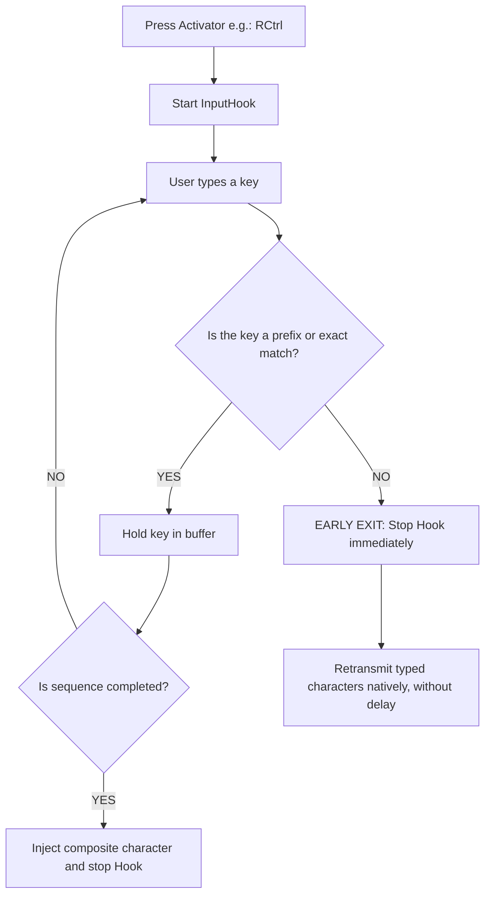

⚠️ **Note:**  
✨ **100% AI‑powered 🪄 project** — concept, analysis, code, testing, documentation — with the **human** 👨‍💻 in the loop as **big boss** 👨‍💼 for **control**, **fine‑tuning**, and **decision-making** 🤔😉🤫.  

---  

# THE COMPLETE AllCharsAHK MANUAL
**User Guide, Configuration, Technical Architecture, and Comparative Reference**

---

## Table of Contents
1. [Introduction and Motivation](#1-introduction-and-motivation)
   - [1.1. What is AllCharsAHK?](#11-what-is-allcharsahk)
   - [1.2. History of the original AllChars utility and limitations of the past](#12-history-of-the-original-allchars-utility-and-limitations-of-the-past)
   - [1.3. Why AllCharsAHK? The need for a modern solution on Windows](#13-why-allcharsahk-the-need-for-a-modern-solution-on-windows)
2. [The Compose Key Concept and Comparative Analysis](#2-the-compose-key-concept-and-comparative-analysis)
   - [2.1. What is a Compose Key? Origins (DEC LK201) and operating principle](#21-what-is-a-compose-key-origins-dec-lk201-and-operating-principle)
   - [2.2. Compose Key vs. Dead Keys vs. Alt+Numpad](#22-compose-key-vs-dead-keys-vs-altnumpad)
   - [2.3. Detailed comparative analysis of similar solutions](#23-detailed-comparative-analysis-of-similar-solutions)
     - [2.3.1. Original AllChars (Jeroen Laarhoven)](#231-original-allchars-jeroen-laarhoven)
     - [2.3.2. AllChars C# fork (knah/AllChars)](#232-allchars-c-fork-knahallchars)
     - [2.3.3. WinCompose (Sam Hocevar)](#233-wincompose-sam-hocevar)
     - [2.3.4. Compose-for-Windows (Randy Fellmy)](#234-compose-for-windows-randy-fellmy)
     - [2.3.5. Native Windows keyboard layouts (Standard / Programmer)](#235-native-windows-keyboard-layouts-standard--programmer)
     - [2.3.6. Microsoft Keyboard Layout Creator (MSKLC)](#236-microsoft-keyboard-layout-creator-msklc)
   - [2.4. Comparative matrix and competitive advantages of AllCharsAHK](#24-comparative-matrix-and-competitive-advantages-of-allcharsahk)
3. [Technical Architecture and Design Principles](#3-technical-architecture-and-design-principles)
   - [3.1. Event interception: Why Global Hooks instead of TSF?](#31-event-interception-why-global-hooks-instead-of-tsf)
   - [3.2. Early Exit engine (zero perceptible typing latency)](#32-early-exit-engine-zero-perceptible-typing-latency)
   - [3.3. Dynamic startup validation: Redefinitions and Ambiguities](#33-dynamic-startup-validation-redefinitions-and-ambiguities)
   - [3.4. AutoScroller GUI manager and DPI scaling](#34-autoscroller-gui-manager-and-dpi-scaling)
   - [3.5. Advanced Unicode support: Grapheme Clusters and compound Emojis (ZWJ)](#35-advanced-unicode-support-grapheme-clusters-and-compound-emojis-zwj)
   - [3.6. Internationalization (i18n) System: Multilingual Support (Romanian, English, German) and Autodetection](#36-internationalization-i18n-system-multilingual-support-romanian-english-german-and-autodetection)
     - [3.6.1. Extensibility guide: How to add a new language (Manually or via AI Agents)](#361-extensibility-guide-how-to-add-a-new-language-manually-or-via-ai-agents)
4. [Complete Configuration Guide (AllCharsAHK.cfg)](#4-complete-configuration-guide-allcharsahkcfg)
   - [4.1. Configuration file format (UTF-8)](#41-configuration-file-format-utf-8)
   - [4.2. Global system variables and bilingual aliases](#42-global-system-variables-and-bilingual-aliases)
   - [4.3. Key mapping definition syntax](#43-key-mapping-definition-syntax)
   - [4.4. Strict comment rules and hash symbol (#)](#44-strict-comment-rules-and-hash-symbol)
   - [4.5. Supported escape sequences (\\, \#, \", \n, \r, \t, \cb)](#45-supported-escape-sequences----n-r-t-cb)
5. [Practical User Guide (Daily Workflow)](#5-practical-user-guide-daily-workflow)
   - [5.1. Typing diacritics and common symbols](#51-typing-diacritics-and-common-symbols)
   - [5.2. Help Window (listing variables and mappings)](#52-help-window-listing-variables-and-mappings)
   - [5.3. Interactive Rare Characters panel](#53-interactive-rare-characters-panel)
   - [5.4. Predefined Strings insertion window](#54-predefined-strings-insertion-window)
   - [5.5. Multi-String multiplier (MulSir)](#55-multi-string-multiplier-mulsir)
   - [5.6. System Tray Menu (Customized and Translated)](#56-system-tray-menu-customized-and-translated)
6. [Installation, Integration, and Troubleshooting (Troubleshooting & FAQ)](#6-installation-integration-and-troubleshooting-troubleshooting--faq)
   - [6.1. System requirements and running](#61-system-requirements-and-running)
   - [6.2. Auto-start with Windows (Startup)](#62-auto-start-with-windows-startup)
   - [6.3. Interacting with elevated UAC windows (Administrator rights)](#63-interacting-with-elevated-uac-windows-administrator-rights)
   - [6.4. Error diagnosis and troubleshooting](#64-error-diagnosis-and-troubleshooting)
   - [6.5. Known issues and environmental limitations](#65-known-issues-and-environmental-limitations)
   - [6.6. Frequently Asked Questions (FAQ)](#66-frequently-asked-questions-faq)
7. [Glossary of Terms](#7-glossary-of-terms)
8. [Conclusions and Future Directions](#8-conclusions-and-future-directions)
9. [License](#9-license)
10. [Warranty](#10-warranty)

---

## 1. Introduction and Motivation

### 1.1. What is AllCharsAHK?
**AllCharsAHK** is a script developed in **AutoHotkey v2**, intended to extend text input capabilities in the Windows operating system. It allows fast and intuitive typing of [Unicode](https://home.unicode.org/) characters such as: diacritics (e.g.: ă, â, î, ș, ț, Ă, Â, Î, Ș, Ț,...), typographical, mathematical, scientific, and currency symbols, as well as complex Unicode characters (including advanced emoji sequences), without needing to change the operating system's keyboard layout and without the use of cumbersome `Alt + NumPad` codes.

The basic principle consists of pressing and releasing an **activator key** (such as `Ctrl`, `Shift`, or `Alt`), followed by a short mnemonic sequence of 1–2 keys (for example, if you have the mapping: `rc a -> ă`, a short press of the `Right Ctrl` key, followed by `a` $\rightarrow$ generates the letter `ă`).

### 1.2. History of the original AllChars utility and limitations of the past
The idea originates from the freeware utility that later became open-source, **AllChars**, created in the 1990s by **Jeroen Laarhoven** (hosted on [SourceForge - AllChars](https://sourceforge.net/projects/allchars/)). Created for Windows 95, 98, 2000, and XP, AllChars was a tool highly appreciated by translators, journalists, and programmers, as it emulated the behavior of a *Compose* key without requiring dedicated hardware.

However, the original utility gradually became unusable due to insurmountable structural limitations:
1. **Lack of native Unicode support:** AllChars was designed in the era of ANSI code pages (Windows-1250, Windows-1252,...). It could not generate characters beyond the 8-bit set, failing completely in handling Unicode characters.
2. **Incompatibility with 64-bit Windows and new architectures:** 32-bit hooks often failed in native 64-bit applications on Windows 10 and 11.
3. **Complete abandonment of development:** The original project (v5.0 in testing phase) received no further updates after 2009, becoming incompatible with modern security mechanisms (UAC, UIPI) and modern High-DPI monitors.

### 1.3. Why AllCharsAHK? The need for a modern solution on Windows
Many users – especially programmers, technical writers, and professionals everywhere – prefer the **US English** keyboard layout because it allows direct and easy access to square brackets, curly braces, slashes, and special characters frequently used in coding (`{`, `}`, `[`, `]`, `/`, `\`, `<`, `>`).

Switching from one keyboard layout to another involves continuously switching the input language (`Win + Space` or `Alt + Shift`), relocating certain symbols, or having to hold down the `AltGr` key concurrently with other keys, which tires the hand and causes typing errors.

**AllCharsAHK** solves this dilemma:
- Permanently preserves the base keyboard layout (e.g.: US QWERTY).
- Allows typing diacritics and symbols as a fluent and sequential succession, not as forced key chords (you do not have to hold keys down simultaneously, but it also does not interfere in any way with applications that require this).
- It is **simple** (does not require administrator rights, does not install background services, does not pollute the Windows Registry).
- Offers unlimited extensibility through a simple UTF-8 text configuration file.

---

## 2. The Compose Key Concept and Comparative Analysis

### 2.1. What is a Compose Key? Origins (DEC LK201) and operating principle
The concept of a **Compose** key (sometimes also called a *composition key*) was first introduced on a large scale in 1983 by **DEC (Digital Equipment Corporation)** on the professional **LK201** keyboard, shipped with the legendary VT220 video terminal (see documentation on [Wikipedia: Compose key](https://en.wikipedia.org/wiki/Compose_key)).

```
┌─────────────────────────────────────────────────────────────┐
│ [Compose Character] ──> Pressed and released                │
│          │                                                  │
│          ▼                                                  │
│   Active composition state (listening mode)                 │
│          │                                                  │
│          ├── Key 'c'                                        │
│          ├── Key 'o'                                        │
│          │                                                  │
│          ▼                                                  │
│      Result injected into application: ©                    │
└─────────────────────────────────────────────────────────────┘
```

Unlike conventional modifier keys (`Shift`, `Ctrl`, `Alt`) which must be held down **simultaneously** with the character key (key chord), the Compose key is a **state/prefix** key:
1. The user presses and releases the Compose key. The utility enters the composition state.
2. The user types 1, 2, or more characters from visual memory or logical associations.
3. The utility intercepts the sequence, deletes it on the spot, and injects the resulting composite character.

### 2.2. Compose Key vs. Dead Keys vs. Alt+Numpad
To understand the efficiency of the solution, it is worth comparing[^1] the main existing mechanisms:

| Criterion | Dead Keys | Alt Numpad Codes | Classic Compose Key | **AllCharsAHK** |
| :--- | :--- | :--- | :--- | :--- |
| **Typing mechanism** | Press accent $\rightarrow$ nothing appears $\rightarrow$ press letter | Hold `Alt` down + 4-digit code on numeric NumPad | Compose key $\rightarrow$ mnemonic character sequence | **Short activator (Ctrl/Shift/Alt)** $\rightarrow$ **mnemonic sequence** |
| **Mental effort** | Medium (must switch keyboard layout) | Huge (must memorize decimal code tables) | Low (logical visual associations) | **Minimal (associations completely user-configurable)** |
| **Typing speed** | Medium (but introduces errors when you want the accent as a standalone symbol) | Extremely slow | Very fast | **Maximum (no chords, sequentially typed keys)** |
| **Hardware dependency** | Changes the role of standard keys (e.g.: quotes become dead keys) | Strictly requires a full physical keyboard with NumPad | Requires an allocated dedicated key | **Zero (works on any laptop or 60%/TKL keyboard)** |
| **String flexibility** | Predefined single characters only | Single characters only | Generally single characters | **Single characters AND complex text strings** |

---

### 2.3. Detailed comparative analysis of similar solutions
(see [^1])

#### 2.3.1. Original AllChars (Jeroen Laarhoven)
* **Author:** Jeroen Laarhoven
* **Technology:** Delphi, native Win32, compiled for x86, freeware release.
* **Strengths:** Introduced the ingenious concept of using briefly tapped `Ctrl` or `Shift` keys as activation keys.
* **Weaknesses:** Abandoned since 2009; restricted to the ANSI set (extended ASCII); no support for modern UTF-8/UTF-16 encodings; no support for modern 64-bit Windows; rigid configuration options.

#### 2.3.2. AllChars C# fork (knah/AllChars)
* **Source & Notoriety:** [knah/AllChars on GitHub](https://github.com/knah/AllChars).
* **Technology:** Reimplementation in C# (.NET Framework) with `SetWindowsHookEx` P-Invoke hooks.
* **Strengths:** Demonstrated the viability of bringing AllChars into the modern 64-bit universe and partially resolved compatibility issues on Windows 7/8/10.
* **Weaknesses:** Dependency on the .NET runtime; increased RAM footprint; stagnant project unupdated since 2016 for recent High-DPI requirements; lack of interactive visual tools for rare characters or text multiplication, XML configuration file.

#### 2.3.3. WinCompose (Sam Hocevar)
* **Source:** [WinCompose on GitHub](https://github.com/samhocevar/wincompose) (~3,000 stars).
* **Technology:** C# / .NET / WPF.
* **Strengths:** Considered the most popular Compose utility on Windows. Includes over 1,700 standard X11 rules (`.XCompose`), offers a complete graphical sequence search explorer, emoji search mode, and direct hexadecimal mode. Uses a prefix tree (*Trie*) for fast cancellation (*Early Exit*).
* **Weaknesses:** 
  - Appreciable memory consumption (30–60 MB RAM) and noticeable startup time due to the WPF/.NET runtime.
  - Lack of support for long text fragments or dynamic string multiplication operations.
  - User rule configuration in `.XCompose` file is relatively rigid and unfriendly for quick hot modifications.

#### 2.3.4. Compose-for-Windows (Randy Fellmy)
* **Source:** [Compose-for-Windows on GitHub](https://github.com/Coises/Compose-for-Windows).
* **Technology:** Pure native C++ (Win32 API), without external dependencies.
* **Strengths:** Tiny memory footprint (~2-5 MB); instantaneous launch; configuration through modern JSON files with comments (`.jsonc`); full support for HTML entities (`&copy;` $\rightarrow$ `©`) and implicit diacritic combining rules.
* **Weaknesses:** Does not offer graphical search interfaces or visual panels for selecting rare characters; oriented exclusively towards blind typing from memory.

#### 2.3.5. Native Windows keyboard layouts (Standard / Programmer)
* **Technology:** Win64 DLL keyboard drivers.
* **Strengths:** Natively integrated into Windows; works even on the login / UAC screen without background processes.
* **Weaknesses:**
  - *Standard:* It may change the position of some characters or move brackets and punctuation marks essential for programming to other keys.
  - *Programmer:* Requires holding down the `Right Alt` (`AltGr`) key combined simultaneously with other letters. This forced combination causes muscular fatigue during extended typing and can conflict with shortcuts in IDEs (Visual Studio, VS Code, JetBrains,...).
  - All keyboard layouts are fixed and do not group, in the user's desired personal style, the necessary Unicode characters.

#### 2.3.6. Microsoft Keyboard Layout Creator (MSKLC)
* **Source:** [Microsoft Keyboard Layout Creator 1.4](https://www.microsoft.com/en-us/download/details.aspx?id=102134) (official Microsoft utility).
* **Technology:** C/C++ keyboard driver compiler paired with a graphical frontend developed in .NET Framework. Generates `.klc` source files, native system DLLs (32-bit and 64-bit), and `.msi` installation packages.
* **Strengths:**
  - *Native integration at the lowest level:* The created arrangement is compiled into a system DLL and registered as a native keyboard layout in Windows.
  - *Universal operation on secure screens:* Works natively on the authentication / lock screen (Login/Lock) and in elevated UAC windows with Administrator rights, without needing to bypass UIPI (*User Interface Privilege Isolation*) barriers or run processes with special permissions.
  - *Zero background resource consumption:* Does not run any resident process in memory (`.exe` or background script); the DLL module is mapped directly into the active process by the Windows graphical subsystem. Additional RAM consumed: 0 MB.
  - *Immunity to protection systems / Anti-Cheat:* Not using global keyboard hooks (`WH_KEYBOARD_LL`), it does not trigger alerts or blocks in corporate antivirus/EDR solutions and competitive games.
  - *Enterprise distribution:* Generates standard `.msi` installation packages, ideal for centralized deployment via group policies (GPO / Intune).
* **Weaknesses:**
  - *Lack of a sequential Compose key concept:* It is strictly limited to conventional Windows mechanisms: dead keys (*Dead Keys*) or shift states with physical key chords (`AltGr` / `Shift+AltGr`). Dead keys can hinder fluent typing of standalone symbols (e.g.: `~`, `'`, `^`), and combinations with `AltGr` cause muscular fatigue and conflict with shortcuts in development environments (IDEs).
  - *Inflexibility to modifications (no hot-reloading):* Any adjustment to a mapping requires repeating the entire cycle: edit `.klc` file $\rightarrow$ recompile $\rightarrow$ generate `.msi` installer $\rightarrow$ uninstall previous package $\rightarrow$ restart/logoff Windows $\rightarrow$ install new package.
  - *Limitation to single characters (no strings or macros):* Binds keys only to single code points or restricted ligatures of a few characters. It cannot generate long blocks of text, dynamic templates, macros with insertion from clipboard (`\cb`), or arbitrary multi-character sequences (MulSir).
  - *Lack of any visual assistance:* It does not feature an interactive clickable panel for rare/mathematical characters, nor help windows or search for defined sequences.
  - *Technological obsolescence and scaling issues on Windows 10/11:* The frontend dates back to the .NET 1.1/2.0 era (requires manual activation of the optional .NET Framework 3.5 component on modern systems), is not adapted for High-DPI monitors (interface appears minuscule or blurred on 4K screens), and may present incompatibilities on new architectures (e.g.: Windows on ARM).
  - *Pollution of the Windows language list:* Adds a separate language/keyboard to the operating system's taskbar, increasing the risk of accidental switching through `Win + Space` or `Alt + Shift` shortcuts.

---

### 2.4. Comparative matrix and competitive advantages of AllCharsAHK
(see [^1])

| Feature / Criterion | AllChars Orig. | knah/AllChars (C#) | WinCompose | Compose-for-Windows | MSKLC | **AllCharsAHK** |
| :--- | :---: | :---: | :---: | :---: | :---: | :---: |
| **RAM memory footprint** | ~2 MB | ~25 MB | ~40-60 MB | ~3 MB | **0 MB (without process)** | **~6-10 MB** |
| **Total portability[^2] (No installation)** | ✔️ | ⚠️ (requires .NET) | ⚠️ (requires .NET) | ✔️ | ❌ (Requires MSI installation) | **✔️ (100% Portable[^2])** |
| **Full Unicode & Emoji ZWJ support** | ❌ (ANSI only) | ⚠️ Partial | ✔️ | ✔️ | ⚠️ Partial (without ZWJ/Emoji) | **✔️ (Extracted Grapheme Clusters)** |
| **Hot modification of configuration** | ❌ | ❌ | ⚠️ (Restart GUI) | ⚠️ (Reload) | ❌ (Recompile + Logoff) | **✔️ (Text file edit + Reload via AutoHotkey)** |
| **Configurable activator key (Ctrl/Shift/Alt)** | ✔️ | ✔️ | ⚠️ (Single key) | ⚠️ (Single key) | ❌ (Dead Keys / AltGr only) | **✔️ (Distinct activators lc, rc, ls, rs etc.)** |
| **Early Exit mechanism (Zero latency)** | ❌ | ❌ | ✔️ | ❌ | N/A (Native at OS level) | **✔️ (Implemented via `InputHook.OnChar`)** |
| **Automatic conflict validation (Ambiguities)** | ❌ | ❌ | ⚠️ Partial | ❌ | ✔️ (Upon validation in compiler) | **✔️ (Detection of duplicates + prefixes at startup)** |
| **Clickable visual panel for Rare Characters** | ❌ | ❌ | ❌ | ❌ | ❌ | **✔️ (Dedicated integrated panel)** |
| **Predefined strings insertion & Macro[^3] `\cb`** | ❌ | ❌ | ❌ | ❌ | ❌ (Only characters/ligatures) | **✔️ (Strings window with quick access)** |
| **Text string multiplier (MulSir)** | ❌ | ❌ | ❌ | ❌ | ❌ | **✔️ (Generator of code divider lines & comments)** |
| **High-DPI adaptive scaling (4K/large screens)** | ❌ | ❌ | ✔️ | ❌ | ❌ (Legacy interface) | **✔️ (Native Win32 AutoScroller)** |
| **Operation on secure screens (UAC / Login)** | ❌ | ❌ | ❌ | ❌ | **✔️ (Integrated as OS driver)** | ⚠️ (Requires Admin / UIAccess rights) |

[^1]: Values and evaluations are approximate and depend on versions, runtime, system configuration, and execution state; they do not represent controlled benchmarks.
[^2]: In this document, "portable" is used in the sense of installation portability (it can be placed in a directory located anywhere on the SSD or even on a USB stick), not in the sense of portable to another operating system. AutoHotkey (and implicitly this script) is designed to work only on Windows.
[^3]: Strictly for this script, by "macro" it is understood only that the sequence `\cb` in a string is replaced with the current text from the Clipboard, nothing more.

---

## 3. Technical Architecture and Design Principles

### 3.1. Event interception: Why Global Hooks instead of TSF?
In the Windows operating system, there are two main paths for intercepting and manipulating the keyboard:
1. **Text Services Framework (TSF):** The complex COM architecture promoted by Microsoft for Asian keyboards (IMEs) and speech recognition.
2. **Global Low-Level Keyboard Hooks (`WH_KEYBOARD_LL` via `SetWindowsHookEx`):** The classic, ultra-fast system-level interception mechanism.

**Why did AutoHotkey (and implicitly AllCharsAHK) choose Global Hooks (elegantly abstracted through the `InputHook` class in AutoHotkey v2)?**
- **Portability:** TSF mandates registering COM servers in the Windows Registry (`CLSID`, `ITfTextInputProcessor`), requiring mandatory Administrator privileges upon installation. With Global Hooks, the script runs from any directory or from a USB stick.
- **Universality:** TSF has compatibility issues in legacy applications, fullscreen video games, or system consoles (`cmd.exe`, PowerShell, Windows Terminal). Global Hooks capture the keyboard uniformly, theoretically speaking, in **any** active window.
- **Security and Isolation:** An erroneous TSF module is loaded directly into the host application process (*in-process DLL*); if a crash occurs, it will crash Word, the browser, or the development environment directly. The Global Hook runs in a completely isolated process; if the script stops, no application in the system is affected.

### 3.2. Early Exit engine (zero perceptible typing latency)
A frequent problem with Compose-type utilities is the sensation of keyboard "stickiness": if the user presses the activator key by mistake and then wants to write normally, letters could be delayed until a timer (*timeout*) expires.

AllCharsAHK solves this problem through an **imperceptible Early Exit algorithm**:


Thanks to the `CheckSequence` function attached to the `ih.OnChar` event, on every typed character the script instantly checks whether the current buffer is a prefix of any valid sequence. If the pressed key does not belong to any mapping (for example, you pressed `Right Ctrl` and then immediately `w`, an unmapped letter), the hook deactivates in less than a millisecond and sends the key natively to the application, without the user noticing any interruption.

### 3.3. Dynamic startup validation: Redefinitions and Ambiguities
To ensure trouble-free operation during typing, AllCharsAHK analyzes the entire `AllCharsAHK.cfg` file at every startup and applies two strict validation filters:

#### 1. Validation against redefinitions (Duplicates)
If the same key combination is defined twice (even through expanding generic keys such as `c` into `lc` and `rc`), the script stops execution and displays the exact lines in the configuration file that contain the duplicate.

#### 2. Validation against ambiguities (Prefixes)
An ambiguity occurs when a shorter sequence is an exact prefix of a longer sequence associated with the same activator.
*Example of a dangerous ambiguity:*
```ini
rc z -> 😀
rc z x -> 😟
```
If this conflict were permitted, the script would not know whether upon typing `Right Ctrl` followed by `z` it should immediately send `😀` or wait further to see if the user will also press the `x` key. AllCharsAHK refuses to run if it detects such situations, informing the user precisely about the conflicting mappings.

### 3.4. AutoScroller GUI manager and DPI scaling
AllCharsAHK features its own architectural class `AutoScroller` written directly on top of the Win32 API (`user32.dll`), guaranteeing a professional-grade graphical experience:
- **Total DPI-Awareness:** Calculates the real scaling factor of the screen (`GetDpiForWindow` / `A_ScreenDPI`) and resizes controls, spacings, and fonts proportionally, without blurriness on 2K/4K screens or Surface tablets.
- **Complete bidirectional scrolling (VScroll / HScroll):** In the Help, Rare Characters, or MulSir windows, it adds native Win32 scrollbars and intercepts `WM_VSCROLL`, `WM_HSCROLL`, and `WM_MOUSEWHEEL` messages.
- **The 3/4 (75%) of the screen rule:** In accordance with strict design requirements, no window of the script exceeds under any circumstances 3/4 (75%) of the visible screen width or height (`0.75 * A_ScreenWidth`, `0.75 * A_ScreenHeight`). If the content or enlarged font exceeds this space, native Win32 scrollbars (vertical and/or horizontal) and fluid mouse wheel support are automatically activated.

### 3.5. Advanced Unicode support: Grapheme Clusters and compound Emojis (ZWJ)
Many utilities fail when trying to display modern emojis on buttons, because they treat strings as byte arrays or individual UTF-16 characters.
A modern compound emoji, such as **👨‍🦳** (*Man: White Hair*), is actually formed of 3 distinct code points linked invisibly through **Zero-Width Joiner (ZWJ)**:
`U+1F468` (Man) + `U+200D` (ZWJ) + `U+1F9B3` (White Hair).

Because the simple token `\X` in PCRE does not implicitly bind ZWJ sequences and regional flags in all contexts, AllCharsAHK uses an advanced regular expression pattern in the `ExtrageGraphemeClusters()` function:
```autohotkey
ExtrageGraphemeClusters(str) {
    clusters := []
    pos := 1
    ; Recognizes compound characters: regional flag pairs, ZWJ sequences (e.g.: 👨‍💻), and tone modifiers
    pat := "(?:[\x{1F1E6}-\x{1F1FF}]{2}|\X[\x{1F3FB}-\x{1F3FF}]?)(?:\x{200D}(?:[\x{1F1E6}-\x{1F1FF}]{2}|\X[\x{1F3FB}-\x{1F3FF}]?))*"
    while (pos := RegExMatch(str, pat, &m, pos)) {
        clusters.Push(m[0])
        pos += m.Len[0]
    }
    return clusters
}
```
This algorithm recognizes each visual ensemble as a single **Extended Grapheme Cluster**, enabling the flawless rendering of the symbol on a single cell/button in the rare characters matrix, without corrupt characters or separated glyphs.

### 3.6. Internationalization (i18n) System: Multilingual Support (Romanian, English, German) and Autodetection
To provide a native experience for users everywhere, AllCharsAHK integrates a flexible internationalization (**i18n**) subsystem, designed according to the following principles:

1. **Centralized dictionary decoupled from execution logic:**  
   All texts displayed in interfaces (the Help, Strings, Rare Characters, MulSir windows, options in the System Tray menu, and validation dialog boxes at initialization) are managed through an internal `I18N` dictionary natively structured across three languages: Romanian (`ro`), English (`en`), and German (`de`). The helper function `T(key)` instantly accesses the appropriate term without any latency or additional memory consumption.

2. **Hybrid selection mechanism (Autodetection with override capability):**  
   - **Autodetection via Win32 API:** At startup, the script calls the native function `GetUserDefaultUILanguage()` from the Windows subsystem. If the returned identifier is `0x0418` (corresponding to the Romanian language, `ro-RO`), the interface automatically starts in Romanian. If the primary identifier is `0x07` (corresponding to German dialects in Germany, Austria, Switzerland, etc.), the interface automatically starts in German (`de`). For any other unsupported system language (for instance `en-US` `0x0409`), the script automatically defaults to English.
   - **Explicit override in the `.cfg` file:** The user can force the desired language at any time by defining the variable `Limba = "ro"`, `Language = "en"`, or `Language = "de"`.

3. **Preliminary scan for faithful reporting of configuration errors:**  
   Before beginning to parse mappings and validate ambiguities, AllCharsAHK performs a quick preliminary scan of the `AllCharsAHK.cfg` file to extract the `Limba` / `Language` directive. In this way, even if syntax errors, key redefinitions, or ambiguities appear on the first lines in the file, the error dialog boxes are displayed from the very beginning in the language requested by the user.

#### 3.6.1. Extensibility guide: How to add a new language (Manually or via AI Agents)

Thanks to the total decoupling of the message dictionary from the script's logic, adding a new language (for example French, Spanish, Italian, etc.) is a task that is **completely safe and trivial to perform**, both for a human developer and for an **AI Agent** (such as Gemini, Claude, ChatGPT, or assistants programmed in modern IDEs like Cursor or VS Code).

##### 1. Why is it a safe and risk-free procedure?
* **Total functional isolation:** It is not necessary to modify any system function, Win32 scrolling algorithms, keyboard hooks, or window calculations.
* **Native protection via Fallback:** If a key is accidentally omitted in the new language, the `T(key)` function will automatically supply the English version. The script will not freeze and will not generate runtime errors when calling interfaces.

##### 2. Reference of keys in the `I18N` dictionary
A language block in `AllCharsAHK.ahk` is a `Map()` object that contains the following standard semantic keys:

| Category | Key `I18N` | Role / Destination in Interface |
| :--- | :--- | :--- |
| **Help Window** | `HELP_TITLE` | Title of the main help window |
| | `HELP_VARS_HDR` | Header of the global variables section |
| | `HELP_MAPS_HDR` | Header of the key sequence mappings table section |
| | `HELP_ACTION_HELP` | Table label for help window action |
| | `HELP_ACTION_RARE` | Table label for rare characters panel action |
| | `HELP_ACTION_SIRURI` | Table label for strings window action |
| | `HELP_ACTION_MULSIR` | Table label for MulSir multiplier action |
| | `BTN_CLOSE` | Text of the close button |
| **Strings Panel** | `SIRURI_TITLE` | Title of the predefined strings window |
| | `SIRURI_EMPTY` | Warning message when strings list is empty |
| **Rare Characters Panel** | `RARE_TITLE` | Title of the interactive rare characters matrix |
| | `RARE_EMPTY` | Warning message when `RareUnic` variable is empty |
| **MulSir Multiplier** | `MULSIR_TITLE` | Title of the multiplication window |
| | `MULSIR_LBL_SRC` | Label of the source field (`Caracter/Sir:`) |
| | `MULSIR_BTN_GEN` | Button to generate multiplication |
| | `MULSIR_LBL_RES` | Label of the output field (`rezultat:`) |
| | `MULSIR_BTN_SEND` | Button to send to the target application |
| | `MULSIR_ERR_COUNT` | Error message when repetition count is 0 or invalid |
| | `MULSIR_ERR_TITLE` | Title of the MulSir error box |
| **System Tray Menu** | `TRAY_HELP` | Option to open the help window |
| | `TRAY_RELOAD` | Option to reload configuration |
| | `TRAY_EXIT` | Option to definitively close the utility |
| **Configuration Errors (.cfg)** | `CFG_ERR_NOT_FOUND` | Message when `.cfg` file is missing from disk |
| | `CFG_ERR_NOT_FOUND_TITLE` | Title of error dialog for missing file |
| | `CFG_ERR_LINE_FMT` | Line format in validation errors (e.g.: `Line {1}: {2}`) |
| | `CFG_ERR_REDEF_TITLE` | Title of error box for duplicate sequences |
| | `CFG_ERR_REDEF_HDR` | Header of error message for redefinition |
| | `CFG_ERR_REDEF_LINES` | Label of lines affected by duplicate |
| | `CFG_ERR_REDEF_STOP` | Final text informing that execution was stopped |
| | `CFG_ERR_AMBIG_TITLE` | Title of error box for ambiguities |
| | `CFG_ERR_AMBIG_HDR` | Header of error message for ambiguity |
| | `CFG_ERR_AMBIG_PREFIX` | Description of prefix conflict ({1} prefix of {2} on {3}) |
| | `CFG_ERR_AMBIG_LINES` | Label of mappings causing the ambiguity |
| | `CFG_ERR_AMBIG_STOP` | Final text informing that execution was stopped |

##### 3. Concrete example: German language integration (`"de"`) and adding French (`"fr"`)
AllCharsAHK already includes the complete German (`"de"`) dictionary built into `AllCharsAHK.ahk`, serving as the canonical reference model:

```autohotkey
    "de", Map(
        "HELP_TITLE", "AllCharsAHK - Hilfe",
        "HELP_VARS_HDR", "=== GLOBALE VARIABLEN ===",
        "HELP_MAPS_HDR", "=== TASTENSEQUENZ-ZUORDNUNGEN ===",
        "HELP_ACTION_HELP", "[Hilfefenster]",
        "HELP_ACTION_RARE", "[Seltene Zeichen Panel]",
        "HELP_ACTION_SIRURI", "[Textbausteine Fenster]",
        "HELP_ACTION_MULSIR", "[Multi-String Fenster]",
        "BTN_CLOSE", "Schließen",
        "SIRURI_TITLE", "AllCharsAHK - Textbausteine",
        "SIRURI_EMPTY", "Die Liste der Textbausteine ist leer!",
        "RARE_TITLE", "AllCharsAHK - Seltene Zeichen",
        "RARE_EMPTY", "Keine seltenen Zeichen definiert!",
        "MULSIR_TITLE", "AllCharsAHK - Zeichenfolge vervielfachen",
        "MULSIR_LBL_SRC", "Zeichen/Text:",
        "MULSIR_BTN_GEN", "Generieren",
        "MULSIR_LBL_RES", "Ergebnis:",
        "MULSIR_BTN_SEND", "Senden",
        "MULSIR_ERR_COUNT", "Ungültige Anzahl an Wiederholungen!",
        "MULSIR_ERR_TITLE", "AllCharsAHK - Fehler",
        "CFG_ERR_NOT_FOUND", "Konfigurationsdatei AllCharsAHK.cfg nicht gefunden!`n`nPfad: ",
        "CFG_ERR_NOT_FOUND_TITLE", "AllCharsAHK - Konfigurationsfehler",
        "CFG_ERR_LINE_FMT", "Zeile {1}: {2}",
        "CFG_ERR_REDEF_TITLE", "AllCharsAHK - Neudefinitionsfehler",
        "CFG_ERR_REDEF_HDR", "Fehler in AllCharsAHK.cfg:`nTastensequenz doppelt definiert!`n`nSequenz: ",
        "CFG_ERR_REDEF_LINES", "Betroffene Zeilen:",
        "CFG_ERR_REDEF_STOP", "Skriptausführung wurde gestoppt.",
        "CFG_ERR_AMBIG_TITLE", "AllCharsAHK - Mehrdeutigkeitsfehler",
        "CFG_ERR_AMBIG_HDR", "Fehler in AllCharsAHK.cfg:`nMehrdeutigkeit in Tastensequenzen erkannt!`n`n",
        "CFG_ERR_AMBIG_PREFIX", "Die kürzere Sequenz ({1}) ist ein echtes Präfix von ({2}) für {3}.`n`n",
        "CFG_ERR_AMBIG_LINES", "Verursachende Zuordnungen:",
        "CFG_ERR_AMBIG_STOP", "Skriptausführung wurde gestoppt.",
        "TRAY_HELP", "Hilfe",
        "TRAY_RELOAD", "Neu laden",
        "TRAY_EXIT", "Beenden"
    )
```

German is already active natively (automatically detected on German Windows systems or forced via `Language = "de"` in `AllCharsAHK.cfg`).

To add an additional new language (for example **French** – `"fr"`), a similar block is added to `Global I18N := Map(...)`:

```autohotkey
    "fr", Map(
        "HELP_TITLE", "AllCharsAHK - Aide",
        "HELP_VARS_HDR", "=== VARIABLES GLOBALES ===",
        "HELP_MAPS_HDR", "=== MAPPAGES DES TOUCHES ===",
        "HELP_ACTION_HELP", "[Fenêtre d'aide]",
        "HELP_ACTION_RARE", "[Panneau Caractères Rares]",
        "HELP_ACTION_SIRURI", "[Fenêtre Chaînes de texte]",
        "HELP_ACTION_MULSIR", "[Fenêtre Multi-Chaîne]",
        "BTN_CLOSE", "Fermer",
        "SIRURI_TITLE", "AllCharsAHK - Chaînes de texte",
        "SIRURI_EMPTY", "La liste des chaînes est vide !",
        "RARE_TITLE", "AllCharsAHK - Caractères Rares",
        "RARE_EMPTY", "Aucun caractère rare défini !",
        "MULSIR_TITLE", "AllCharsAHK - Multiplier la chaîne",
        "MULSIR_LBL_SRC", "Caractère/Texte :",
        "MULSIR_BTN_GEN", "Générer",
        "MULSIR_LBL_RES", "Résultat :",
        "MULSIR_BTN_SEND", "Envoyer",
        "MULSIR_ERR_COUNT", "Nombre de répétitions invalide !",
        "MULSIR_ERR_TITLE", "AllCharsAHK - Erreur MulSir",
        "CFG_ERR_NOT_FOUND", "Fichier AllCharsAHK.cfg introuvable !`n`nChemin : ",
        "CFG_ERR_NOT_FOUND_TITLE", "AllCharsAHK - Erreur de configuration",
        "CFG_ERR_LINE_FMT", "Ligne {1} : {2}",
        "CFG_ERR_REDEF_TITLE", "AllCharsAHK - Erreur de redéfinition",
        "CFG_ERR_REDEF_HDR", "Erreur dans AllCharsAHK.cfg :`nSéquence de touches déjà définie !`n`nSéquence : ",
        "CFG_ERR_REDEF_LINES", "Lignes affectées :",
        "CFG_ERR_REDEF_STOP", "L'exécution du script est arrêtée.",
        "CFG_ERR_AMBIG_TITLE", "AllCharsAHK - Erreur d'ambiguïté",
        "CFG_ERR_AMBIG_HDR", "Erreur dans AllCharsAHK.cfg :`nAmbiguïté détectée !`n`n",
        "CFG_ERR_AMBIG_PREFIX", "La séquence courte ({1}) est un préfixe exact de ({2}) pour {3}.`n`n",
        "CFG_ERR_AMBIG_LINES", "Mappages causant l'ambiguïté :",
        "CFG_ERR_AMBIG_STOP", "L'exécution du script est arrêtée.",
        "TRAY_HELP", "Aide",
        "TRAY_RELOAD", "Recharger",
        "TRAY_EXIT", "Quitter"
    )
```

To activate the new language, add to `AllCharsAHK.cfg`:
```ini
Language = "fr"
```

##### 4. Recommended prompt for AI Agents
If you wish to delegate adding a new language to an AI assistant, copy and pass the following prompt:

> [!TIP]
> **Ready-to-use Prompt for the AI Agent:**  
> *„Please add the language [DESIRED_LANGUAGE] (code: [ISO_CODE]) to the `Global I18N` dictionary in the `AllCharsAHK.ahk` script. Keep all existing keys unmodified, translate the terms faithfully for a Windows productivity application, respect the AutoHotkey v2-specific escape sequences (such as `` `n ``), and make sure you do not modify the rest of the script's logic.”*

---

## 4. Complete Configuration Guide (`AllCharsAHK.cfg`)

### 4.1. Configuration file format (UTF-8)
The `AllCharsAHK.cfg` file must mandatorily reside in the same directory as the `AllCharsAHK.ahk` script. It is a plain text file, encoded strictly in **UTF-8 (without BOM, preferably, or with BOM)**. It can be edited with Notepad, VS Code, Notepad++, or any preferred UTF-8 editor.

### 4.2. Global system variables and bilingual aliases
Each global variable is defined on its own line, using the `=` separator. To ensure natural configuration for both Romanian speakers and English speakers, the parser recognizes both canonical Romanian names and a series of **equivalent international aliases** (case-insensitive):

| Variable (Romanian) | International Alias (English) | Data Type | Default Value | Description |
| :--- | :--- | :---: | :---: | :--- |
| `Limba` | `Language` | Text | `""` (autodetection) | Interface language (`"ro"`, `"en"`, or `"de"`). If missing, it is determined automatically from Windows. |
| `TimpSec` | `TimeoutSec`, `Timeout` | Decimal (sec) | `2.0` | Maximum waiting time between sequence keys (0 = unlimited). |
| `DimFont` | `FontSize` | Integer (pt) | `16` | Font size for text windows (Help, Strings, MulSir). |
| `RareFontSize` | `RareFontSize` | Integer (pt) | `20` | Font size for the button matrix of Rare Characters. |
| `CombHelp` | `CombHelp` | Sequence | `c h h` | Combination to open the Help window. |
| `CombRareUnic` | `CombRareChars` | Sequence | `c j j` | Combination to open the Rare Characters panel. |
| `CombSiruri` | `CombStrings` | Sequence | `c j k` | Combination to open the Predefined Strings list. |
| `CombMltSir` | `CombMultiStrings` | Sequence | `c k j` | Combination to open the String Multiplier (MulSir). |
| `RareUnic` | `RareChars` | Text | `""` | Collections of rare symbols/emojis (can be defined on multiple consecutive lines). |
| `Siruri` | `Strings` | Text | `[]` | Predefined text strings (one string per line). |

#### Example Configuration (`AllCharsAHK.cfg`):
```ini
# Interface language ("en", "ro", or "de")
Language = "en"

# Maximum wait time (seconds) between keypresses
TimeoutSec = 1.5

# Font size (points) for script windows
FontSize = 14

# Font size for the Rare Characters panel
RareFontSize = 20

# Hotkey sequences for special windows
CombHelp = c h h
CombRareChars = c j j
CombStrings = c j k
CombMultiStrings = c k j

# Collections of rare characters
RareChars = "©®™●◯✗✓Å⚠️¶«»·…‰¢¤→↑←↓⇒⇔⇨⇉↔–—∞"
RareChars = "₀₁₂₃₄₅₆₇₈₉⁰¹²³⁴⁵⁶⁷⁸⁹¼½¾"
RareChars = "🙂☹️😞🙃🤔🤫😉😀😂🤣🤩😇😏😠🤪🤥🥱😴😰🤕🥳😈👿👽🤖👻"

# Predefined strings for quick insertion
Strings = "Best regards,\nMy Name"
Strings = "Summary: \cb"
Strings = "(💬Just talking!) "
Strings = "(🚀Go! Go! Go!) "
Strings = "(📝🗹All approvals granted!) "
Strings = "Is it true? "
Strings = "Your comments? "
```

### 4.3. Key mapping definition syntax
Mappings are defined on a single line, using the arrow separator `->`:
```ini
[trigger_key] [key_1] [key_2] ... -> [replacement_value]
```

#### Modifiers (Activator Keys) available:
- `lc` or `lctrl` = Left Control key (Ctrl left)
- `rc` or `rctrl` = Right Control key (Ctrl right)
- `c` or `ctrl` = Any Control key (will automatically generate both variants: `lc` and `rc`)
- `ls` or `lshift` = Left Shift key (Shift left)
- `rs` or `rshift` = Right Shift key (Shift right)
- `s` or `shift` = Any Shift key (will automatically generate `ls` and `rs`)
- `la` or `lalt` = Left Alt key (Alt left)
- `ra` or `ralt` = Right Alt key (Alt right)
- `a` or `alt` = Any Alt key (will automatically generate `la` and `ra`)

#### Spacing and quotation rules:
1. Spaces around the `->` separator are automatically removed (`Trim`).
2. Multiple consecutive spaces between trigger keys on the left are compressed to a single space.
3. If the value on the right is enclosed in double quotes (e.g.: `" text  "`), the outer quotes are removed, but **all spaces inside them are preserved with exactness**. If quotes are not used, spaces at edges are automatically removed.

---

### 4.4. Strict comment rules and hash symbol (`#`)

> [!IMPORTANT]
> In AllCharsAHK, the character `#` introduces a comment up to the end of the line (exactly like in Python, Bash, or classic INI files).
> Truncation of comments is performed **at the raw line level**, before evaluating quotes.

This design rule implies a fundamental behavior that must be remembered:

1. **Quotes DO NOT cancel comments:**
   If you write:
   ```ini
   lc c -> "The code is #1234"
   ```
   The parser encounters the `#` character and cuts the line immediately, considering the rest as a comment! The resulting line would be invalid (`lc c -> "The code is `).

2. **How to use the `#` character as literal text:**
   Wherever you need the hash/pound character – either as a trigger key on the left, as a value on the right, or inside text within quotes – **it must be mandatorily prefixed with backslash (`\#`)**:

```ini
# Complete comment line (ignored)

# Correct: escaped # character in value (both variants are valid and produce #####)
lc \# -> \#\#\#\#\#
lc \# -> "\#\#\#\#\#"

# Correct: escaped # character inside a quoted string
rc c -> "\# is inside a string, not a comment"
```

---

### 4.5. Supported escape sequences (`\\`, `\#`, `\"`, `\n`, `\r`, `\t`, `\cb`)
AllCharsAHK recognizes and uniformly decodes the following special sequences:

| Sequence | Resulting Character | Usage Context | Practical Example |
| :-: | :-: | :--- | :--- |
| `\\` | `\` | Literal backslash | `rc r -> "\"R:\\Temp\\\""` $\rightarrow$ `"R:\Temp\"` |
| `\#` | `#` | Hash / pound character | `lc \# -> "\#\#\#\#\#"` $\rightarrow$ `#####` |
| `\"` | `"` | Double quotes inside string | `rc g -> "\"Text citat\""` $\rightarrow$ `"Text citat"` |
| `\n` | `Line Feed` (0x0A) | Line feed (newline) | `rc 2 -> "Linia 1\nLinia 2"` |
| `\r` | `Carriage Return` (0x0D) | Carriage return | In combination with `\n` for Windows line endings |
| `\t` | `Tab` (0x09) | Horizontal tab | Used especially in String Multiplier (`MulSir`) |
| `\cb` | Clipboard Contents | **Dynamic macro[^3]:** Replaces sequence with current text from Clipboard | `Siruri = "Rezumat: \cb"` |

---
## 5. Practical User Guide (Daily Workflow)

### 5.1. Typing diacritics and common symbols
Using AllCharsAHK becomes second nature within minutes of installation. The typing style is relaxed and does not strain the fingers. For example, if you have the following mappings in your configuration file:
```
rc a -> ă
rs a -> Ă
```

- To type **ă**: briefly press the `Right Ctrl` key, release it, then press `a`.
- To type **Ă**: briefly tap the `Right Shift` key, release it, then press `a`.

If you pressed the activator key by mistake, simply continue typing: the script applies *Early Exit* and will not hold back any of your keys or press the `Escape` key.

---

### 5.2. Help Window (listing variables and mappings)
If you have forgotten a key combination or wish to consult the current script configuration, type the combination assigned to the help window (default: `Ctrl` followed by `h` and `h`):

```
┌─────────────────────────────────────────────────────────────┐
│ AllCharsAHK - Help                                          │
├─────────────────────────────────────────────────────────────┤
│ === GLOBAL VARIABLES ===                                    │
│                                                             │
│ TimeoutSec    = 2.0                                         │
│ FontSize      = 14                                          │
│ RareFontSize  = 20                                          │
│ CombHelp      = c h h                                       │
│ CombRareChars = c j j                                       │
│ CombStrings   = c j k                                       │
│ CombMultiStr  = c k j                                       │
│ RareChars     = "©®™●◯✗✓Å⚠️¶«»·…‰¢¤→↑←↓⇒⇔⇨⇉↔–—∞"             │
│ Strings       = "(💬Just talking!) "                        │
│                                                             │
│ === KEY SEQUENCE MAPPINGS ===                               │
│                                                             │
│ LCtrl 0       -> °                                          │
│ LCtrl ,       -> „                                          │
│ LCtrl '       -> ’                                          │
│ RCtrl a       -> ă                                          │
│ RShift a      -> Ă                                          │
│ RCtrl q       -> â                                          │
│ RCtrl s       -> ș                                          │
│ RCtrl t       -> ț                                          │
│ LCtrl i       -> î                                          │
│ ...                                                         │
├─────────────────────────────────────────────────────────────┤
│                                                   [ Close ] │
└─────────────────────────────────────────────────────────────┘
```

- **Structured and readable display:** The window lists the values of all global system variables, followed by all active key mappings, sorted alphabetically and perfectly aligned in columns.
- **Read-only monospace text:** The content is displayed in an `Edit` box with the `Consolas` font at `FontSize` size, equipped with vertical and horizontal scrollbars (`VScroll`, `HScroll`).
- **Quick closing:** Pressing the `Escape` key, clicking the `Close` button, or pressing the `Enter` key instantly closes the window and reactivates the application you were working in.

> [!NOTE]
> **Automatic multilingual localization of the Help window:**  
> AllCharsAHK adapts its UI to the operating system language or the configured `Language` setting:
> - In **English** (`Language = "en"` or non-Romanian/non-German systems), headers display as `=== GLOBAL VARIABLES ===` and `=== KEY SEQUENCE MAPPINGS ===`, variables use international names (`TimeoutSec`, `FontSize`, etc.), special actions are labeled `[Help Window]`, `[Rare Characters Panel]`, `[Strings Window]`, `[Multi-String Window]`, and the button is labeled `Close`.
> - In **Romanian** (`Language = "ro"`), headers display as `=== VARIABILE GLOBALE ===` and `=== MAPĂRI SECVENȚE TASTE ===`, and the button is labeled `Închide`.
> - In **German** (`Language = "de"`), headers display as `=== GLOBALE VARIABLEN ===` and `=== TASTENFOLGEN-ZUORDNUNGEN ===`, and the button is labeled `Schließen`.), special actions become `[Help Window]`, `[Rare Characters Panel]`, `[Strings Window]`, `[Multi-String Window]`, and the button bears the text `Close`.

---

### 5.3. Interactive Rare Characters panel
Rare characters are Unicode characters used less frequently in writing, for which creating a dedicated mapping is not justified, as it would be inefficient to memorize dozens of key combinations. Examples of such symbols: fractions, mathematical indices, technical characters, emojis, etc. This panel allows quick insertion of these characters into the target application. To activate the panel, type the combination `CombRareChars` (default: `Ctrl` followed by `j` and `j`).

A visual matrix opens:
- Each character in the `RareChars` variables is displayed on a button.
- **A single click** on any symbol sends it instantly to the target application and does not automatically close the panel.
- The window features native scrolling with the mouse wheel if you have configured hundreds of characters.
- Pressing the Escape key closes the window at any time and returns focus to the target application.

---

### 5.4. Predefined Strings insertion window
Through the combination `CombStrings` (default: `Ctrl` followed by `j` and `k`), you open the list of long text fragments configured in `Strings = ...`:
- Click on the button with the respective string: the string is inserted directly into the target document.
- If the string contains the `\cb` marker, AllCharsAHK will automatically paste at that spot the text currently in the Clipboard! The resulting string is inserted directly into the target document.
- Pressing the Escape key closes the window at any time and returns focus to the target application.

---

### 5.5. Multi-String multiplier (`MulSir`)
For programmers and technical authors, quick generation of separation lines, comment boxes, indentations, or tables in source code is a frequent operation. The combination `CombMultiStrings` (default: `Ctrl` followed by `k` and `j`) opens the specialized **MulSir** module:

```
┌────────────────────────────────────────────────────────────────────────┐
│ AllCharsAHK - Multi-String                                             │
├────────────────────────────────────────────────────────────────────────┤
│ Char/String:  [ *          ]  ×  [ 80  ]  [ Generate ]                 │
│ result:       [ **************************************************** ] │
│                                                            [ Send ]    │
├────────────────────────────────────────────────────────────────────────┤
│ [©] [®] [™] [●] [◯] [✗] [✓] [Å] [⚠️] [¶] [«] [»] [·] […] [‰] [¢] [¤]    │
│ [₀] [₁] [₂] [₃] [₄] [₅] [₆] [₇] [₈] [₉] [⁰] [¹] [²] [³] [⁴] [⁵] [⁶]    │
│ [🙂] [☹️] [😞] [🙃] [🤔] [🤫] [😉] [😀] [😂] [🤣] [🤩] [😇] [😏] [😠]   │
└────────────────────────────────────────────────────────────────────────┘
```

#### Workflow in MulSir:
1. **Row 1 (Source and multiplication):**
   - **`Char/String:`** Text box where you type the desired character or fragment. Supports the escape sequences `\n`, `\r`, `\t`, and `\\` (for example `\t` for tab or `=` for double line).
   - **`× [Repetitions]:`** Numeric box (limited to 3 digits) where you specify how many times you want to repeat the fragment (for example `80`).
   - **Button `[ Generate ]`:** Instantly multiplies the source text and inserts it at the cursor position in the result box.
2. **Row 2 (Visualization and dispatch):**
   - **`result:`** Box where you can view, verify, or manually edit the generated text before injection.
   - **Button `[ Send ]`:** Sends text directly to the target application (Notepad, VS Code, terminal, etc.) and restores its focus.
3. **Row 3 (Integrated Rare Characters grid):**
   - In the lower half, the complete grid with symbols from `RareChars` is displayed (with the `Segoe UI Emoji` font of size `RareFontSize`).
   - **A click on any symbol** inserts it instantly at the current cursor position in the active box (`Char/String` or `result`).
4. **Easy closing:** Pressing the `Escape` key closes the MulSir window at any time and restores focus in the target application.

#### Practical multiplication examples in MulSir:
- `Char/String: =` $\times 80$ $\rightarrow$ generates an 80-character double separator line.
- `Char/String: #` $\times 60$ $\rightarrow$ generates a 60-character hash line for Python/Bash scripts.
- `Char/String: -` $\times 40$ $\rightarrow$ generates a text separator line.
- `Char/String: \t` $\times 4$ $\rightarrow$ generates 4 consecutive tabs for rapid indentation.

### 5.6. System Tray Menu (Customized and Translated)
AllCharsAHK configures a dedicated, simplified, and clean menu in the notification area (**System Tray**), accessible by right-clicking on the script's green icon:

* **Help** *(default action)*: Directly opens the Help Window with all variables and mappings (same effect as double-clicking the tray icon).
* **Reload**: Reloads the script and re-parses the `AllCharsAHK.cfg` file to apply recent modifications, without needing to manually restart the process.
* *(Separator)*
* **Exit**: Definitively closes the AllCharsAHK utility and releases all keyboard hooks.

> [!NOTE]
> On operating systems with Romanian or German regional settings, the tray menu is automatically localized: **Ajutor** / **Reîncarcă** / **Ieșire** in Romanian, and **Hilfe** / **Neu laden** / **Beenden** in German.
* **Informative Tooltip:** Hovering over the icon in the System Tray displays the text `AllCharsAHK`.

---

## 6. Installation, Integration, and Troubleshooting (Troubleshooting & FAQ)

### 6.1. System requirements and running
1. **Operating System:** Windows 11.
2. **Runtime Environment:** [AutoHotkey v2.0+](https://www.autohotkey.com/) installed on the system (the `AutoHotkey64.exe` file).
3. **Installation:** Copy the `AllCharsAHK.ahk` script into any directory you wish.
4. **Configuration:** Create the UTF-8 configuration file `AllCharsAHK.cfg` in the exact same directory as `AllCharsAHK.ahk`. The two files must mandatorily reside in the same directory for correct operation.
5. **Running:** Double-click on `AllCharsAHK.ahk`. An icon will appear in the System Tray, confirming that the script is active and ready.

### 6.2. Auto-start with Windows (Startup)
For AllCharsAHK to be available automatically upon computer startup:
1. Press `Win + R`, type `shell:startup`, and press `Enter`.
2. Create a shortcut (*Shortcut*) to the `AllCharsAHK.ahk` file and place it in that folder.

### 6.3. Interacting with elevated UAC windows (Administrator rights)
Windows includes a security mechanism called **UIPI (User Interface Privilege Isolation)**: an application running with standard user rights cannot send keystrokes to a window running with Administrator rights (such as a Command Prompt terminal or Task Manager opened as Administrator).

> [!TIP]
> 1. The `AllCharsAHK.ahk` script must be reloaded every time you modify the `AllCharsAHK.cfg` configuration file.  
> 2. If you notice that AllCharsAHK works everywhere, but does not insert diacritics into Administrator windows, launch the script by right-clicking on `AllCharsAHK.ahk` $\rightarrow$ **Run as administrator**, or create a dedicated task in Windows Task Scheduler with the option *Run with highest privileges*.

---

### 6.4. Error diagnosis and troubleshooting

#### 1. The message: "Redefinition of a key sequence!"
Appears at script startup if you have defined the same sequence twice. The message box will indicate the exact line numbers from `AllCharsAHK.cfg`. Open the file, delete or rename the duplicate, and restart the script.

#### 2. The message: "Ambiguity detected in key sequences!"
Appears when a shorter sequence is the prefix of a longer one (e.g.: `rc a` and `rc a b`). Change one of the sequences so that their beginnings are distinct.

#### 3. The `#` symbol cuts off desired text
You forgot to add a backslash in front of the `#` character. Replace `#` with `\#` in the configuration file.

---

### 6.5. Known issues and environmental limitations

Although AllCharsAHK is designed to function fluently and transparently in the vast majority of applications on Windows 11, the nature of system-level keyboard interception (Global Hooks) and input emulation (`SendInput`) involves certain limitations inherent to the operating system's architecture and other software categories:

#### 1. Exclusive video games and Anti-Cheat mechanisms (DirectInput / Raw Input)
* **Manifestation:** In certain video games (especially those run in *Exclusive Fullscreen* mode or competitive online titles), composition sequences are not intercepted, and resulting characters cannot be transmitted into game chat or interface.
* **Technical Cause:** Modern action games often bypass the classic Windows message queue (`WM_KEYDOWN` / `WM_CHAR`) and read the keyboard at the hardware level via **DirectInput** or **Raw Input** APIs. Furthermore, kernel-level anti-cheat solutions (such as *Riot Vanguard*, *Easy Anti-Cheat*, *BattlEye*) may deliberately block global keyboard hooks (`WH_KEYBOARD_LL`) and synthetic event injection (`SendInput`) to combat automated bots and macros.
* **Solution / Recommendation:** Running the game in *Borderless Windowed* mode can sometimes allow receiving text, but in titles protected by kernel-level anti-cheat systems the behavior remains restricted by design.

#### 2. Dependency on the active keyboard layout in the target window
* **Manifestation:** Keys typed after the activator key do not correspond to the configured characters (for example, pressing the physical `q` or `a` key cancels the sequence or introduces another symbol).
* **Technical Cause:** The `InputHook` object in AutoHotkey interprets input keys relative to the active keyboard layout associated with the thread of the foreground window. If Windows automatically switches the active layout to another language (for instance German QWERTZ or French AZERTY via `Alt + Shift` or per-application regional settings), the scan codes and characters generated by physical keys differ from mappings designed for the **US English QWERTY** layout.
* **Solution / Recommendation:** Ensure that the active window uses the keyboard layout for which you performed the configuration.

#### 3. Remote Desktop Sessions (RDP, Citrix, VMware, VNC)
* **Manifestation:** In a remote work session or virtual machine, composite characters may arrive fragmented, duplicated, or missing entirely if network latency is variable.
* **Technical Cause:** Remote access programs (such as *Remote Desktop Connection* - `mstsc.exe`) capture the keyboard through a high-level hook and transmit events over the network in the form of RDP packets. Depending on the client setting regarding Windows commands (*„Apply Windows key combinations: On the remote computer”*), the activator key may be consumed on the local machine or remotely, and rapid injection via `SendInput` may outpace remote stream processing.
* **Solution / Recommendation:** It is recommended to run the AllCharsAHK utility directly on the machine where content is being drafted (either inside the virtual machine/RDP session or on the host physical machine, adjusting keyboard redirection settings of the RDP client).

#### 4. User Interface Privilege Isolation (UIPI) in elevated Administrator windows
* **Manifestation:** AllCharsAHK runs normally in most applications, but does not insert characters into a Command Prompt console run as Administrator, in Task Manager, or in other system utilities started with elevated rights.
* **Technical Cause:** The **UIPI (User Interface Privilege Isolation)** security mechanism in Windows forbids a process with medium integrity level (standard user) from sending messages or simulating keys to processes with high integrity level (*High Integrity* / Administrator).
* **Solution / Recommendation:** Launch the AllCharsAHK script with administrator rights (*Run as administrator*) or create a task in Windows Task Scheduler with the option *Run with highest privileges* (as detailed in [Section 6.3](#63-interacting-with-elevated-uac-windows-administrator-rights)).

#### 5. Endpoint security suites, banking applications, or anti-keylogger protection (DLP)
* **Manifestation:** Interception of sequences stops abruptly or activator keys become inactive upon switching to certain secure windows.
* **Technical Cause:** Corporate security solutions (Data Loss Prevention - DLP), secure browsers for online payments (e.g.: *Kaspersky Safe Money*, *Trusteer Rapport*, *Bitdefender Safepay*), or anti-keylogger utilities install their own zero-priority keyboard filters, decoupling or ignoring the `WH_KEYBOARD_LL` hook chain to shield passwords and confidential data from interception.
* **Solution / Recommendation:** This is an intentional self-defense mechanism of those protected applications; AllCharsAHK resumes its automatic operation immediately upon bringing a regular work window back to the foreground.

#### 6. Rendering of complex Unicode glyphs in legacy applications or terminals
* **Manifestation:** The Unicode sequence is injected correctly, but an empty rectangle (`□`), question mark, or truncated glyphs are displayed on screen.
* **Technical Cause:** Although AllCharsAHK transmits Unicode sequences correctly in UTF-16/UTF-8, older applications or classic consoles (such as old `cmd.exe` configured with raster fonts) do not include support for the modern **DirectWrite** subsystem and lack automatic fallback mechanisms to the system's symbol/emoji fonts (`Segoe UI Emoji`).
* **Solution / Recommendation:** Use modern editors and terminals (such as *Windows Terminal*, *Visual Studio Code*, or Notepad in Windows 11) or select a modern TrueType/OpenType font with broad Unicode coverage (*Cascadia Code*, *Consolas*, *Segoe UI*) for that application.

#### 7. Rendering on Win32 buttons of recent ZWJ Emoji sequences (Unicode 15.1+)
* **Manifestation:** In the „Rare Characters” panel or in „MulSir”, buttons for certain very new emojis (such as `🙂‍↕️` [head shaking vertically] or `🙂‍↔️` [head shaking horizontally]) display the smiling face `🙂` on the top row and the directional arrow (`↕` or `↔`) on the bottom row, instead of a single unified glyph.
* **Technical Cause:** These characters are ZWJ (*Zero Width Joiner*) sequences introduced in Unicode 15.1 (autumn 2023). The script's internal algorithm recognizes them flawlessly as a single cluster and sends the correct binary sequence on click. However, the classic Win32/GDI graphics subsystem and the system font `Segoe UI Emoji` do not yet feature a unified graphical glyph for them. In compliance with the Unicode standard, the renderer resorts to the *fallback* mechanism, displaying individual components (`🙂` followed by arrow); due to limited button width (52×52 px) at `RareFontSize` font, text is automatically wrapped onto two rows (*word wrap*).
* **Solution / Recommendation:** Behavior is purely visual and limited to the button face in the Win32 interface. Text insertion into documents or applications works correctly, and in modern applications with full DirectWrite support the character will be rendered properly. The button glyph will automatically become unified once Microsoft updates the `Segoe UI Emoji` font file with dedicated drawings for Unicode 15.1 in future Windows updates.

---

### 6.6. Frequently Asked Questions (FAQ)

To provide quick answers to the most common practical questions regarding the daily operation of AllCharsAHK, we have synthesized this list of questions and answers:

#### 1. How must the activator key be pressed: held down (in chord) or sequentially?
**A:** Always **sequentially**. You briefly press and release the activator key (for example `Right Ctrl` if you have mapping `rc a -> ă`), and only then type the letters or symbols of the sequence (for instance `a` for `ă`). It is incorrect to hold the activator key down while typing the rest of the combination.

#### 2. What happens if I change my mind or make a mistake on a letter after pressing the activator key?
**A:** Thanks to the *Early Exit* architecture (early cancellation), the instant the pressed key no longer matches the beginning of any sequence defined in configuration, AllCharsAHK automatically leaves the listening state. The mistakenly typed key is transmitted instantly to the application you are typing in, without delays or lost characters. You can also explicitly cancel the listening state at any time by pressing the `Escape` key.

#### 3. Why don't I see my new shortcuts immediately after modifying the `AllCharsAHK.cfg` file?
**A:** The configuration file is parsed and loaded into memory exclusively upon script initialization. For changes to take effect, you must reload the script: right-click the icon in the System Tray and choose **Reload** (or **Reîncarcă** in Romanian), or double-click `AllCharsAHK.ahk` (the *SingleInstance Force* option will replace it automatically).

#### 4. How are activator keys chosen? Is there a single or default activator key?
**A:** **No, there is no single default key.** AllCharsAHK offers total flexibility and supports **6 independent activator keys simultaneously**: `LCtrl` (`lc`), `RCtrl` (`rc`), `LShift` (`ls`), `RShift` (`rs`), `LAlt` (`la`), `RAlt` (`ra`), plus generic forms `c` (any Ctrl), `s` (any Shift), `a` (any Alt). The activator key is specified directly at the beginning of each mapping line in the `AllCharsAHK.cfg` file (for example `rc a -> ă` uses Right Ctrl, while `lc i -> î` uses Left Ctrl). You can distribute as many mappings as you like across any of these activators according to your desired ergonomics.

#### 5. How can I include the hash character (`#`) or quotes (`"`) in a string or mapping without breaking the `.cfg` file?
**A:** In the `AllCharsAHK.cfg` file, the `#` character signals the start of a comment, and quotes delimit strings. To use them as literal text, they must be mandatorily preceded by the backslash character: `\#`, `\"`, respectively `\\` for backslash.

#### 6. Is AllCharsAHK a keylogger? Can it intercept or compromise my passwords and confidential data?
**A:** **Categorically no.** AllCharsAHK is a 100% transparent and open-source utility, written cleanly in AutoHotkey v2. It makes no network connections, sends no telemetry, creates no log files with typed keys, and stores nothing on disk. The keyboard hook mechanism is used strictly locally and in real time to identify predefined composition sequences.

#### 7. Why aren't composite characters entered when writing in a terminal or program run as Administrator?
**A:** This is a direct consequence of the Windows security mechanism called **UIPI (User Interface Privilege Isolation)**: an application run with standard user rights does not have permission to send messages or keystrokes to a window with elevated privileges (*Elevated / Administrator*). To remedy this behavior, run AllCharsAHK as Administrator as well (right-click on `AllCharsAHK.ahk` $\rightarrow$ *Run as administrator*).

#### 8. Does AllCharsAHK work on Windows 10 or other systems?
**A:** The script was created and tested only on Windows 11; Windows 10 or older versions were not taken into account because Microsoft no longer offers support for them. AllCharsAHK runs only on **AutoHotkey v2.0**, a utility that is not compatible with macOS or Linux, being designed strictly for Windows.

#### 9. Can I use AllCharsAHK in parallel with Microsoft PowerToys or other AutoHotkey scripts?
**A:** Yes, without any problem. All these utilities can coexist peacefully on the system, under a single common-sense condition: do not associate the same activator key or the same global key combination in two programs simultaneously, to avoid priority conflicts in the chain of global hooks.

#### 10. How can I automatically paste text currently in the Clipboard inside a long fragment of text?
**A:** Use the special tag `\cb` in the definition of your string from the `Strings = ...` section. Upon selecting that string from the dedicated panel (`Ctrl + j + k`), AllCharsAHK will automatically replace the `\cb` label with the current contents of the Windows Clipboard and inject the complete text into the document.

#### 11. What is the MulSir module and when is it recommended to use it?
**A:** The **MulSir** module (*String Multiplier*, invoked with `Ctrl + k + j`) is a tool specially designed for developers and technical authors. It allows rapid generation and injection of repetitive delimiter lines (for example 80 `=` characters, 60 `#` characters, multiple indentations with `\t`), without needing to type manually or copy from other files.

#### 12. Can I map sequences composed of more than two characters?
**A:** Yes, AllCharsAHK supports sequences formed of any number of characters (though in practice it is not necessary), provided they do not create prefix ambiguities with other sequences already defined.

#### 13. Which consortium oversees standardizing characters, symbols, emojis, etc. used in writing?
**A:** [Unicode Consortium](https://home.unicode.org/)

#### 14. Where do I find the list of character code charts and emojis standardized by Unicode?
**A:**  
[https://www.unicode.org/Public/18.0.0/charts/](https://www.unicode.org/Public/18.0.0/charts/)  
[https://www.unicode.org/emoji/charts/full-emoji-list.html](https://www.unicode.org/emoji/charts/full-emoji-list.html)

#### 15. What is the Windows utility that allows me to see what characters, symbols, etc. a certain already installed font allows?
**A:** Character Map

#### 16. Is there in Windows any mechanism that allows me to see and insert in applications various characters, symbols, emojis, etc.?
**A:** Yes, press the `Win` + `.` keys simultaneously and the emoji panel will be displayed where you can find *all* Unicode characters (characters, symbols, emojis, etc.) that Windows can work with.

#### 17. Why use AllCharsAHK if Windows already has a mechanism for working with Unicode characters?
**A:** AllCharsAHK allows you to choose and configure the diacritics, symbols, emojis, and strings you need in a uniform and personal manner. You no longer have to search each time to see what capabilities in terms of emojis, for example, one application or another offers you!

#### 18. Are there almost complete open source fonts in terms of Unicode character set, in general, for text editing?
**A:** Yes, there are several excellent options. Among the most recommended:
* [Cascadia Code](https://learn.microsoft.com/en-us/windows/terminal/cascadia-code) ([GitHub](https://github.com/microsoft/cascadia-code)) — developed by Microsoft, comes preinstalled from the factory in Windows 11 (natively included with Windows Terminal).
* [JetBrains Mono](https://www.jetbrains.com/lp/mono/) — specially optimized for maximum readability and rich Unicode support.
* [Google Noto](https://fonts.google.com/noto) — an extensive family of fonts whose name comes precisely from the goal *„**No** more **to**fu”* (eliminating white rectangles `□` for all writing systems and symbols of the world).

You can also explore the extensive catalog of free fonts directly on [Google Fonts](https://fonts.google.com/).

#### 19. How do I switch interface language or use AllCharsAHK in English?
**A:** By default, AllCharsAHK automatically detects the display language of the Windows operating system via the Win32 API (`GetUserDefaultUILanguage`). If Windows has its interface in Romanian (`0x0418`), the script starts in Romanian; for any other operating system language (for example English), it automatically switches to English. If you wish to force a certain language regardless of system settings, simply add the line `Limba = "ro"`, `Language = "en"`, or `Language = "de"` into the `AllCharsAHK.cfg` file.

#### 20. Can I add another language (French, Spanish, Italian, etc.)? How do I do this with an AI Agent?
**A:** Yes, easily! Thanks to the modular architecture of the `I18N` dictionary, adding a new language involves merely copying a set of translations, with zero risk of breaking the script. You can give the instruction directly to an AI assistant using the dedicated prompt in [Section 3.6.1](#361-extensibility-guide-how-to-add-a-new-language-manually-or-via-ai-agents). After inserting the block in `AllCharsAHK.ahk`, activate the language in the `.cfg` file via `Language = "lang_code"` (e.g.: `Language = "de"`).

---
## 7. Glossary of Terms

To ensure a clear and unequivocal understanding of technical, typographical, and system concepts used throughout this manual, we present below the definitions of key terms:

* **Alt+Numpad:** Traditional method integrated into the Windows operating system whereby Unicode or ANSI characters are inserted by holding down the `Alt` key and entering the corresponding numerical code on the dedicated numeric keypad (*Numpad*).
* **Prefix ambiguity:** Structural conflict in the configuration file where a defined sequence represents the identical beginning of another longer sequence (for example `rc a` and `rc a b`). In such situations, the engine cannot know whether the user wants the short character or is waiting for the next key, which is why AllCharsAHK signals this error upon startup.
* **Global Keyboard Hook (`WH_KEYBOARD_LL`):** Low-level mechanism in the Win32 API through which an application registers a callback function called by the Windows kernel upon every key press or release across the entire system, allowing interception and monitoring of events before their transmission to the active window.
* **Compose Key (Composition key):** Special key (originally introduced in 1983 on DEC LK201 keyboards) whose role is to initiate a temporary composition state. The user presses two or more mnemonic characters successively (for example Compose followed by `~` and `a`), and the system generates the resulting composite character (`ã`).
* **Dead Key:** Key specific to classic international keyboard layouts that, upon press, does not visually generate any character on the screen, but modifies the letter typed subsequently by applying an accent (for instance `~` followed by `a` $\rightarrow$ `ã`). Unlike a configurable Compose key, dead keys are rigid, limited by hardware/driver, and can create inconveniences when typing the symbol as such is desired (e.g. tilde or backtick in programming).
* **DirectWrite:** Modern subsystem developed by Microsoft, hardware-accelerated via DirectX, intended for high-quality text rendering, advanced OpenType typography, and comprehensive support for complex Unicode glyphs in Windows.
* **DPI-Awareness:** Architectural feature of a graphical application to detect the pixel density of the monitor on which it is displayed and dynamically resize its interface elements, buttons, and fonts (at 100%, 125%, 150%, 200%), preventing the blurred look (*blur*) caused by automatic bitmap scaling of the operating system.
* **Early Exit (Early cancellation):** Algorithmic optimization technique through which a search or filtering mechanism terminates immediately once it is mathematically ascertained that no future match is possible. In AllCharsAHK, if the key entered after the activator is not found in any prefix in the dictionary, the listening state is abandoned instantaneously, eliminating any latency in typing.
* **Grapheme Cluster:** Visual unit of text that a human user perceives as "a single character" on screen, but which in internal Unicode binary representation may be composed of multiple consecutive code points joined through special control characters.
* **InputHook:** Native high-level object introduced in AutoHotkey v2 that allows secure, flexible, and asynchronous management of keyboard stream capture, offering advanced options for filtering, dynamic matching, and collection of characters.
* **MulSir (String Multiplier):** Utility module and graphical panel integrated in AllCharsAHK, designed for fast multiplication of a text string or graphical symbol $N$ times, useful for drawing demarcation lines, generating comment boxes, or advanced indentations.
* **Code Point:** Unique numeric value assigned to each abstract character in the international Unicode standard (conventionally denoted as `U+XXXX`, for example `U+0103` for lowercase letter `ă`).
* **SendInput:** Optimized function in the Win32 API intended for synthesizing keyboard and mouse events. Events transmitted via `SendInput` are injected directly and indivisibly into the system input stream, preventing accidental interleaving of other physical keystrokes during generation of the composite character.
* **Activator Key:** The key designated through configuration (such as `Right Ctrl` or `Right Shift`) whose short press and release triggers the state of interception and composition of a sequence in AllCharsAHK.
* **UIPI (User Interface Privilege Isolation):** Security technology in Windows (integrated into the UAC subsystem) that isolates windows of processes with medium integrity level (standard user) from processes with high level (*High Integrity* / Administrator), prohibiting sending simulated keyboard messages from a lower level to a higher one.
* **Unicode:** Universal digital character encoding standard maintained by the Unicode Consortium, designed to allow uniform, robust, and platform-independent computing representation of all characters and symbols in the languages of the world.
* **ZWJ (Zero Width Joiner / `U+200D`):** Invisible formatting character in the Unicode standard that requests the graphical renderer to join adjacent characters into a single unified glyph (used extensively for generating complex compound emojis, such as profession, gender, skin tone, or flag sequences).

---

## 8. Conclusions and Future Directions

**AllCharsAHK** represents the synthesis between nostalgia for the classic AllChars utility and the strict performance, scalability, and compatibility requirements of the Windows operating system:
- It is completely independent of heavy runtimes.
- Respects user privacy (sends no data to the internet, does no key logging).
- Offers a writing speed clearly superior to alternative keyboard layouts.
- Provides advanced tools (`MulSir`, DPI-adaptive panels, support for ZWJ emojis).

The project is open to continuous improvements and updates and constitutes a solid productivity tool for any demanding Windows user.

---

## 9. License

This project is licensed under the terms of the [MIT License](LICENSE).

---

## 10. Warranty

No warranty, *whatsoever*, is provided!


