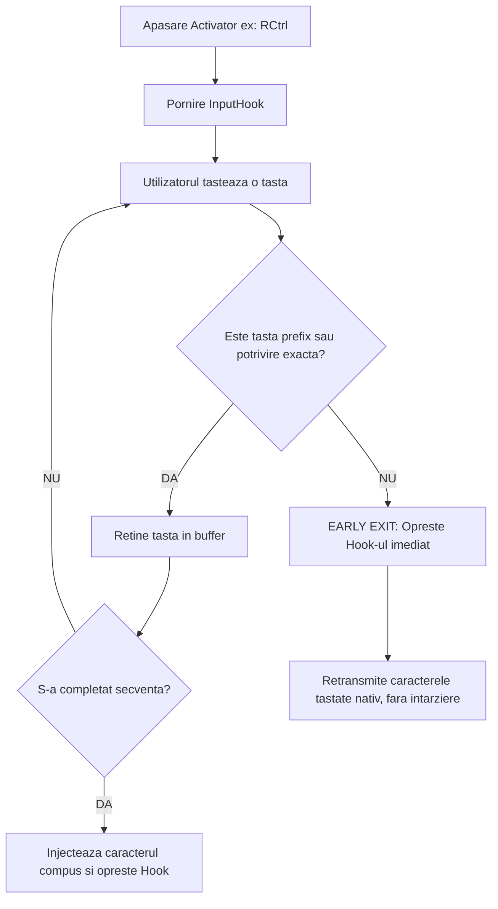

⚠️ **Notă:**  
✨ Proiect **100% AI‑powered 🪄** — concept, analiză, cod, testare, documentație — cu **omul** 👨‍💻 în buclă ca **big boss** 👨‍💼 pentru **control**, **fine‑tuning** și **decizii** 🤔😉🤫.  

---  

# MANUALUL COMPLET AllCharsAHK
**Ghid de Utilizare, Configurare, Arhitectură Tehnică și Referință Comparativă**

---

## Cuprins
1. [Introducere și Motivație](#1-introducere-și-motivație)
   - [1.1. Ce este AllCharsAHK?](#11-ce-este-allcharsahk)
   - [1.2. Istoricul utilitarului original AllChars și limitele trecutului](#12-istoricul-utilitarului-original-allchars-și-limitele-trecutului)
   - [1.3. De ce AllCharsAHK? Nevoia unei soluții moderne pe Windows](#13-de-ce-allcharsahk-nevoia-unei-soluții-moderne-pe-windows)
2. [Conceptul de Tastă Compose și Analiză Comparativă](#2-conceptul-de-tastă-compose-și-analiză-comparativă)
   - [2.1. Ce este o tastă Compose? Origini (DEC LK201) și principiu de funcționare](#21-ce-este-o-tastă-compose-origini-dec-lk201-și-principiu-de-funcționare)
   - [2.2. Tasta Compose vs. Dead Keys vs. Alt+Numpad](#22-tasta-compose-vs-dead-keys-vs-altnumpad)
   - [2.3. Analiză comparativă detaliată a soluțiilor similare](#23-analiză-comparativă-detaliată-a-soluțiilor-similare)
     - [2.3.1. AllChars original (Jeroen Laarhoven)](#231-allchars-original-jeroen-laarhoven)
     - [2.3.2. Fork-ul AllChars în C# (knah/AllChars)](#232-fork-ul-allchars-în-c-knahallchars)
     - [2.3.3. WinCompose (Sam Hocevar)](#233-wincompose-sam-hocevar)
     - [2.3.4. Compose-for-Windows (Randy Fellmy)](#234-compose-for-windows-randy-fellmy)
     - [2.3.5. Layout-urile native de tastatură Windows (Standard / Programatori)](#235-layout-urile-native-de-tastatură-windows-standard--programatori)
     - [2.3.6. Microsoft Keyboard Layout Creator (MSKLC)](#236-microsoft-keyboard-layout-creator-msklc)
   - [2.4. Matrice comparativă și avantajele competitive ale AllCharsAHK](#24-matrice-comparativă-și-avantajele-competitive-ale-allcharsahk)
3. [Arhitectura Tehnică și Principiile de Proiectare](#3-arhitectura-tehnică-și-principiile-de-proiectare)
   - [3.1. Interceptarea evenimentelor: De ce Global Hooks și nu TSF?](#31-interceptarea-evenimentelor-de-ce-global-hooks-și-nu-tsf)
   - [3.2. Motorul de anulare timpurie (Early Exit fără latență perceptibilă)](#32-motorul-de-anulare-timpurie-early-exit-fără-latență-perceptibilă)
   - [3.3. Validarea dinamică la pornire: Redefiniri și Ambiguități](#33-validarea-dinamică-la-pornire-redefiniri-și-ambiguități)
   - [3.4. Managerul de interfață grafică AutoScroller și scalarea DPI](#34-managerul-de-interfață-grafică-autoscroller-și-scalarea-dpi)
   - [3.5. Suport avansat Unicode: Grapheme Clusters și Emoji compuse (ZWJ)](#35-suport-avansat-unicode-grapheme-clusters-și-emoji-compuse-zwj)
   - [3.6. Sistemul de Internaționalizare (i18n): Suport Multilingv (Română, Engleză, Germană) și Autodetecție](#36-sistemul-de-internaționalizare-i18n-suport-multilingv-română-engleză-germană-și-autodetecție)
     - [3.6.1. Ghid de extensibilitate: Cum se adaugă o limbă nouă (Manual sau prin Agenți AI)](#361-ghid-de-extensibilitate-cum-se-adaugă-o-limbă-nouă-manual-sau-prin-agenți-ai)
4. [Ghid Complet de Configurare (AllCharsAHK.cfg)](#4-ghid-complet-de-configurare-allcharsahkcfg)
   - [4.1. Formatul fișierului de configurare (UTF-8)](#41-formatul-fișierului-de-configurare-utf-8)
   - [4.2. Variabile globale de sistem și alias-uri bilingve](#42-variabile-globale-de-sistem-și-alias-uri-bilingve)
   - [4.3. Sintaxa definirii mapărilor de taste](#43-sintaxa-definirii-mapărilor-de-taste)
   - [4.4. Reguli stricte de comentarii și caracterul diez (#)](#44-reguli-stricte-de-comentarii-și-caracterul-diez)
   - [4.5. Secvențe de scăpare suportate (\\, \#, \", \n, \r, \t, \cb)](#45-secvențe-de-scăpare-suportate----n-r-t-cb)
5. [Ghid Practic de Utilizare (Fluxul de Lucru Zilnic)](#5-ghid-practic-de-utilizare-fluxul-de-lucru-zilnic)
   - [5.1. Tastarea diacriticelor și a simbolurilor uzuale](#51-tastarea-diacriticelor-și-a-simbolurilor-uzuale)
   - [5.2. Fereastra de Ajutor (listare variabile și mapări)](#52-fereastra-de-ajutor-listare-variabile-și-mapări)
   - [5.3. Panoul interactiv de Caractere Rare](#53-panoul-interactiv-de-caractere-rare)
   - [5.4. Fereastra de inserare a Șirurilor predefinite](#54-fereastra-de-inserare-a-șirurilor-predefinite)
   - [5.5. Multiplicatorul de Șiruri (MulSir)](#55-multiplicatorul-de-șiruri-mulsir)
   - [5.6. Meniul din System Tray (Personalizat și Tradus)](#56-meniul-din-system-tray-personalizat-și-tradus)
6. [Instalare, Integrare și Depanare (Troubleshooting & FAQ)](#6-instalare-integrare-și-depanare-troubleshooting--faq)
   - [6.1. Cerințe de sistem și rulare](#61-cerințe-de-sistem-și-rulare)
   - [6.2. Pornire automată cu Windows (Startup)](#62-pornire-automată-cu-windows-startup)
   - [6.3. Interacțiunea cu ferestre elevate UAC (Drepturi de Administrator)](#63-interacțiunea-cu-ferestre-elevate-uac-drepturi-de-administrator)
   - [6.4. Diagnosticarea și remedierea erorilor](#64-diagnosticarea-și-remedierea-erorilor)
   - [6.5. Probleme cunoscute și limitări de mediu](#65-probleme-cunoscute-și-limitări-de-mediu)
   - [6.6. Întrebări Frecvente (FAQ)](#66-întrebări-frecvente-faq)
7. [Glosar de Termeni](#7-glosar-de-termeni)
8. [Concluzii și Direcții Viitoare](#8-concluzii-și-direcții-viitoare)
9. [Licență](#9-licență)
10. [Garanție](#10-garanție)

---

## 1. Introducere și Motivație

### 1.1. Ce este AllCharsAHK?
**AllCharsAHK** este un script dezvoltat în **AutoHotkey v2**, destinat extinderii capabilităților de introducere a textului în sistemul de operare Windows. Permite tastarea rapidă și intuitivă a caracterelor [Unicode](https://home.unicode.org/) cum ar fi: diacritice (ex: ă, â, î, ș, ț, Ă, Â, Î, Ș, Ț,...), a simbolurilor tipografice, matematice, științifice, valutare cât și a caracterelor Unicode complexe (inclusiv secvențe avansate de emoji), fără a fi necesară schimbarea layout-ului de tastatură al sistemului de operare și fără utilizarea codurilor greoaie `Alt + NumPad`.

Principiul de bază constă în apăsarea și eliberarea unei **taste activator** (cum ar fi `Ctrl`, `Shift` sau `Alt`), urmată de o secvență mnemotehnică scurtă de 1–2 taste (de exemplu, dacă aveți maparea: `rc a -> ă`, apăsarea scurtă a tastei `Right Ctrl`, urmată de `a` $\rightarrow$ generează litera `ă`).

### 1.2. Istoricul utilitarului original AllChars și limitele trecutului
Ideea își are originea în utilitarul freeware devenit ulterior open-source **AllChars**, creat în anii '90 de **Jeroen Laarhoven** (găzduit pe [SourceForge - AllChars](https://sourceforge.net/projects/allchars/)). Creat pentru Windows 95, 98, 2000 și XP, AllChars a fost o unealtă extrem de apreciată de traducători, jurnaliști și programatori, deoarece emula comportamentul unei taste *Compose* fără a necesita hardware dedicat.

Cu toate acestea, utilitarul original a devenit treptat inutilizabil din cauza unor limitări structurale insurmontabile:
1. **Lipsa suportului Unicode nativ:** AllChars a fost proiectat în era paginilor de cod ANSI (Windows-1250, Windows-1252,...). Nu putea genera caractere dincolo de setul pe 8 biți, eșuând complet la gestionarea caracterelor Unicode.
2. **Incompatibilitatea cu Windows 64-bit și noile arhitecturi:** Hook-urile pe 32 de biți eșuau adesea în aplicațiile native de 64 de biți din Windows 10 și 11.
3. **Abandonarea completă a dezvoltării:** Proiectul original (v5.0 aflat în faza de testare) nu a mai primit actualizări din 2009, devenind incompatibil cu mecanismele moderne de securitate (UAC, UIPI) și cu monitoarele moderne High-DPI.

### 1.3. De ce AllCharsAHK? Nevoia unei soluții moderne pe Windows
Mulți utilizatori – în special programatorii, scriitorii tehnici și profesioniștii de peste tot – preferă layout-ul de tastatură **US English** pentru că permite accesul direct și facil la paranteze drepte, acolade, slash-uri și caractere speciale utilizate frecvent în codare (`{`, `}`, `[`, `]`, `/`, `\`, `<`, `>`).

Trecerea de la un layout de tastatură la altul implică comutarea continuă a limbii de intrare (`Win + Space` sau `Alt + Shift`), relocarea unor simboluri sau necesitatea de a menține apăsată tasta `AltGr` concomitent cu alte taste, ceea ce obosește mâna și provoacă erori de tastare.

**AllCharsAHK** rezolvă această dilemă:
- Păstrează permanent layout-ul de tastatură de bază (ex: US QWERTY).
- Permite tastarea diacriticelor și simbolurilor ca o succesiune fluentă și secvențială, nu ca acorduri forțate de taste (nu trebuie să ții taste apăsate simultan, dar nici nu împietează în vreun fel aplicațiile care cer acest lucru).
- Este **simplu** (nu necesită drepturi de administrator, nu instalează servicii de fundal, nu poluează Windows Registry).
- Oferă extensibilitate nelimitată printr-un fișier simplu de configurare de tip text UTF-8.

---

## 2. Conceptul de Tastă Compose și Analiză Comparativă

### 2.1. Ce este o tastă Compose? Origini (DEC LK201) și principiu de funcționare
Conceptul de tastă **Compose** (denumit uneori și *tastă de compunere*) a fost introdus pentru prima dată pe scară largă în anul 1983 de către corporația **DEC (Digital Equipment Corporation)** pe tastatura profesională **LK201**, livrată cu terminalul video legendar VT220 (vezi documentația pe [Wikipedia: Compose key](https://en.wikipedia.org/wiki/Compose_key)).

```
┌─────────────────────────────────────────────────────────────┐
│ [Compose Character] ──> Apăsat și eliberat                  │
│          │                                                  │
│          ▼                                                  │
│   Stare de compunere activă (listening mode)                │
│          │                                                  │
│          ├── Tasta 'c'                                      │
│          ├── Tasta 'o'                                      │
│          │                                                  │
│          ▼                                                  │
│      Rezultat injectat în aplicație: ©                      │
└─────────────────────────────────────────────────────────────┘
```

Spre deosebire de tastele modificatoare convenționale (`Shift`, `Ctrl`, `Alt`) care trebuie ținute apăsate **simultan** cu tasta de caracter (acord de taste), tasta Compose este o tastă de **stare/prefix**:
1. Utilizatorul apasă și eliberează tasta Compose. Utilitarul intră în starea de compunere.
2. Utilizatorul tastează 1, 2 sau mai multe caractere din memorie vizuală sau asocieri logice.
3. Utilitarul interceptează secvența, o șterge pe loc și injectează caracterul compus rezultat.

### 2.2. Tasta Compose vs. Dead Keys vs. Alt+Numpad
Pentru a înțelege eficiența soluției, merită comparate[^1] principalele mecanisme existente:

| Criteriu | Taste Moarte (*Dead Keys*) | Coduri Alt Numpad | Tastă Compose clasică | **AllCharsAHK** |
| :--- | :--- | :--- | :--- | :--- |
| **Mecanism de tastare** | Apăsare accent $\rightarrow$ nu apare nimic $\rightarrow$ apăsare literă | `Alt` ținut apăsat + cod din 4 cifre pe NumPad numeric | Tastă Compose $\rightarrow$ secvență caractere mnemotehnice | **Activator scurt (Ctrl/Shift/Alt)** $\rightarrow$ **secvență mnemotehnică** |
| **Efort mental** | Mediu (trebuie schimbat layout-ul de tastatură) | Uriaș (trebuie memorate tabele de coduri zecimale) | Redus (asocieri logice vizuale) | **Minim (asocieri complet configurabile de utilizator)** |
| **Viteza de scriere** | Medie (dar introduce erori când dorești accentul ca simbol de sine stătător) | Extrem de lentă | Foarte rapidă | **Maximă (fără acorduri, taste tastate secvențial)** |
| **Dependență hardware** | Schimbă rolul unor taste standard (ex: ghilimelele devin dead keys) | Necesită obligatoriu tastatură fizică completă cu NumPad | Necesită o tastă dedicată alocată | **Zero (funcționează pe orice laptop sau tastatură 60%/TKL)** |
| **Flexibilitate șiruri** | Doar caractere unice predefinite | Doar caractere unice | În general caractere unice | **Caractere unice ȘI șiruri complexe de text** |

---

### 2.3. Analiză comparativă detaliată a soluțiilor similare
(vezi [^1])

#### 2.3.1. AllChars original (Jeroen Laarhoven)
* **Autor:** Jeroen Laarhoven
* **Tehnologie:** Delphi, nativ Win32, compilat pentru x86, varianta freeware.
* **Puncte tari:** A introdus conceptul genial de folosire a tastelor `Ctrl` sau `Shift` atinse scurt drept taste de activare.
* **Puncte slabe:** Abandonat din 2009; limitat la setul ANSI (ASCII extins); fără suport pentru codificări moderne UTF-8/UTF-16; fără suport pentru Windows 64-bit modern; opțiuni de configurare rigide.

#### 2.3.2. Fork-ul AllChars în C# (knah/AllChars)
* **Sursă & Notorietate:** [knah/AllChars pe GitHub](https://github.com/knah/AllChars).
* **Tehnologie:** Reimplementare în C# (.NET Framework) cu hook-uri P-Invoke `SetWindowsHookEx`.
* **Puncte tari:** A demonstrat viabilitatea aducerii AllChars în universul modern pe 64 de biți și a remediat parțial problemele de compatibilitate de pe Windows 7/8/10.
* **Puncte slabe:** Dependență de runtime-ul .NET; amprentă crescută de memorie RAM; proiect stagnant și neactualizat din 2016 pentru cerințele recente de High-DPI; lipsa unor instrumente vizuale interactive pentru caractere rare sau multiplicare de text, fișier de configurare XML.

#### 2.3.3. WinCompose (Sam Hocevar)
* **Sursă:** [WinCompose pe GitHub](https://github.com/samhocevar/wincompose) (~3.000 stele).
* **Tehnologie:** C# / .NET / WPF.
* **Puncte tari:** Este considerat cel mai popular utilitar Compose pe Windows. Include peste 1.700 de reguli standard X11 (`.XCompose`), oferă un explorator grafic complet de căutare a secvențelor, mod de căutare emoji și mod hexazecimal direct. Folosește un arbore de prefixe (*Trie*) pentru anulare rapidă (*Early Exit*).
* **Puncte slabe:** 
  - Consum apreciabil de memorie (30–60 MB RAM) și timp perceptibil de pornire din cauza runtime-ului WPF/.NET.
  - Lipsa suportului pentru fragmente lungi de text sau operațiuni dinamice de multiplicare a șirurilor.
  - Configurarea regulilor utilizatorului în fișier `.XCompose` este relativ rigidă și neprietenoasă pentru modificări rapide la cald.

#### 2.3.4. Compose-for-Windows (Randy Fellmy)
* **Sursă:** [Compose-for-Windows pe GitHub](https://github.com/Coises/Compose-for-Windows).
* **Tehnologie:** C++ nativ pur (Win32 API), fără dependențe externe.
* **Puncte tari:** Amprentă infimă de memorie (~2-5 MB); pornire instantanee; configurare prin fișiere moderne JSON cu comentarii (`.jsonc`); suport complet pentru entități HTML (`&copy;` $\rightarrow$ `©`) și reguli de combinare diacritică implicită.
* **Puncte slabe:** Nu oferă interfețe grafice de căutare sau panouri vizuale pentru selectarea caracterelor rare; orientat exclusiv pe tastare oarbă din memorie.

#### 2.3.5. Layout-urile native de tastatură Windows (Standard / Programatori)
* **Tehnologie:** Drivere de tastatură Win64 DLL.
* **Puncte tari:** Integrate nativ în Windows; funcționează chiar și în ecranul de login / UAC fără procese în fundal.
* **Puncte slabe:**
  - *Standard:* E posibil să schimbe poziția unor caractere sau să mute parantezele și semnele de punctuație esențiale pentru programare pe alte taste.
  - *Programatori:* Necesită menținerea apăsată a tastei `Right Alt` (`AltGr`) combinată simultan cu alte litere. Această combinație forțată generează oboseală musculară la tastarea îndelungată și poate intra în conflict cu scurtăturile din IDE-uri (Visual Studio, VS Code, JetBrains,...).
  - Toate layout-urile de tastatură sunt fixe și nu grupează, în stilul personal dorit de utilizator, caracterele Unicode necesare.

#### 2.3.6. Microsoft Keyboard Layout Creator (MSKLC)
* **Sursă:** [Microsoft Keyboard Layout Creator 1.4](https://www.microsoft.com/en-us/download/details.aspx?id=102134) (utilitar oficial Microsoft).
* **Tehnologie:** Compilator C/C++ de drivere de tastatură asociat cu un frontend grafic dezvoltat în .NET Framework. Generează fișiere sursă `.klc`, DLL-uri native de sistem (pe 32 și 64 de biți) și pachete de instalare `.msi`.
* **Puncte tari:**
  - *Integrare nativă la cel mai jos nivel:* Aranjamentul creat este compilat într-un DLL de sistem și înregistrat ca layout nativ de tastatură în Windows.
  - *Funcționare universală în ecrane securizate:* Funcționează nativ în ecranul de autentificare / blocare (Login/Lock) și în ferestrele elevate UAC cu drepturi de Administrator, fără a necesita ocolirea barierelor UIPI (*User Interface Privilege Isolation*) sau rularea unor procese cu permisiuni speciale.
  - *Consum zero de resurse în fundal:* Nu rulează niciun proces rezident în memorie (`.exe` sau script de fundal); modulul DLL este mapat direct în procesul activ de către subsistemul grafic Windows. Memorie RAM adițională consumată: 0 MB.
  - *Imunitate la sisteme de protecție / Anti-Cheat:* Neutilizând hook-uri globale de tastatură (`WH_KEYBOARD_LL`), nu declanșează alerte sau blocaje în soluțiile antivirus/EDR corporative și în jocurile competitive.
  - *Distribuire enterprise:* Generează pachete standard de instalare `.msi`, ideale pentru implementare centralizată prin politici de grup (GPO / Intune).
* **Puncte slabe:**
  - *Lipsa conceptului de tastă Compose secvențială:* Este limitat strict la mecanismele convenționale Windows: taste moarte (*Dead Keys*) sau stări de shift cu acorduri fizice de taste (`AltGr` / `Shift+AltGr`). Dead keys pot împiedica tastarea fluentă a simbolurilor de sine stătătoare (ex: `~`, `'`, `^`), iar combinațiile cu `AltGr` provoacă oboseală musculară și intră în conflict cu scurtăturile din mediile de dezvoltare (IDE-uri).
  - *Inflexibilitate la modificări (fără reîncărcare la cald):* Orice ajustare a unei mapări impune reluarea întregului ciclu: editare fișier `.klc` $\rightarrow$ recompilare $\rightarrow$ generare instalator `.msi` $\rightarrow$ dezinstalare pachet anterior $\rightarrow$ repornire/logoff Windows $\rightarrow$ instalare pachet nou.
  - *Limitare la caractere unice (fără șiruri sau macro-uri):* Asociază tastele doar cu puncte de cod unice sau ligaturi restrânse de câteva caractere. Nu poate genera blocuri lungi de text, șabloane dinamice, macro-uri cu inserare din clipboard (`\cb`) sau secvențe multi-caracter arbitrare (MulSir).
  - *Lipsa oricărei asistențe vizuale:* Nu dispune de panou interactiv clicabil pentru caractere rare/matematice, nici de ferestre de ajutor sau căutare a secvențelor definite.
  - *Învechire tehnologică și probleme de scalare pe Windows 10/11:* Frontend-ul datează din era .NET 1.1/2.0 (necesită activarea manuală a componentei opționale .NET Framework 3.5 pe sistemele moderne), nu este adaptat monitoarelor High-DPI (interfața apare minusculă sau neclară pe ecrane 4K) și poate prezenta incompatibilități pe arhitecturi noi (ex: Windows on ARM).
  - *Poluarea listei de limbi Windows:* Adaugă o limbă/tastatură separată în bara de sistem a sistemului de operare, mărind riscul comutării accidentale prin scurtăturile `Win + Space` sau `Alt + Shift`.

---

### 2.4. Matrice comparativă și avantajele competitive ale AllCharsAHK
(vezi [^1])

| Funcționalitate / Criteriu | AllChars Orig. | knah/AllChars (C#) | WinCompose | Compose-for-Windows | MSKLC | **AllCharsAHK** |
| :--- | :---: | :---: | :---: | :---: | :---: | :---: |
| **Amprentă memorie RAM** | ~2 MB | ~25 MB | ~40-60 MB | ~3 MB | **0 MB (fără proces)** | **~6-10 MB** |
| **Portabilitate[^2] totală (Fără instalare)** | ✔️ | ⚠️ (cere .NET) | ⚠️ (cere .NET) | ✔️ | ❌ (Necesită instalare MSI) | **✔️ (100% Portabil[^2])** |
| **Suport complet Unicode & Emoji ZWJ** | ❌ (Doar ANSI) | ⚠️ Parțial | ✔️ | ✔️ | ⚠️ Parțial (fără ZWJ/Emoji) | **✔️ (Extracted Grapheme Clusters)** |
| **Modificare la cald a configurării** | ❌ | ❌ | ⚠️ (Restart GUI) | ⚠️ (Reload) | ❌ (Recompilare + Logoff) | **✔️ (Editare fișier text + Reload prin AutoHotkey)** |
| **Tastă activator configurabilă (Ctrl/Shift/Alt)** | ✔️ | ✔️ | ⚠️ (O singură tastă) | ⚠️ (O singură tastă) | ❌ (Doar Dead Keys / AltGr) | **✔️ (Activatori distincți lc, rc, ls, rs etc.)** |
| **Mecanism Early Exit (Latență zero)** | ❌ | ❌ | ✔️ | ❌ | N/A (Nativ la nivel OS) | **✔️ (Implementat prin `InputHook.OnChar`)** |
| **Validare automată conflicte (Ambiguități)** | ❌ | ❌ | ⚠️ Parțial | ❌ | ✔️ (La validare în compilator) | **✔️ (Detecție redefiniri + prefixe la pornire)** |
| **Panou vizual clicabil pentru Caractere Rare** | ❌ | ❌ | ❌ | ❌ | ❌ | **✔️ (Panou dedicat integrat)** |
| **Inserare șiruri predefinite & Macro[^3] `\cb`** | ❌ | ❌ | ❌ | ❌ | ❌ (Doar caractere/ligaturi) | **✔️ (Fereastră Șiruri cu acces rapid)** |
| **Multiplicator de șiruri de text (MulSir)** | ❌ | ❌ | ❌ | ❌ | ❌ | **✔️ (Generator linii & comentarii cod)** |
| **Scalare adaptivă High-DPI (4K/ecrane mari)** | ❌ | ❌ | ✔️ | ❌ | ❌ (Interfață moștenită) | **✔️ (AutoScroller nativ Win32)** |
| **Funcționare în ecrane securizate (UAC / Login)** | ❌ | ❌ | ❌ | ❌ | **✔️ (Integrat ca driver OS)** | ⚠️ (Necesită drepturi Admin / UIAccess) |

[^1]: Valorile și aprecierile sunt aproximative și depind de versiuni, runtime, configurația sistemului și starea de execuție; nu reprezintă benchmark-uri controlate.
[^2]: În acest document „portabil” este folosit cu sensul de portabilitate la instalare (poate fi plasat într-un director aflat oriunde pe SSD sau chiar pe un stick USB), nu în sensul de portabil pe alt sistem de operare. AutoHotkey (implicit și acest script) e conceput să funcționeze numai pe Windows.
[^3]: Strict pentru acest script, prin „macro” se înțelege doar faptul că secvența `\cb` într-un șir este înlocuită cu textul curent din Clipboard, nimic mai mult.

---

## 3. Arhitectura Tehnică și Principiile de Proiectare

### 3.1. Interceptarea evenimentelor: De ce Global Hooks și nu TSF?
În sistemul de operare Windows există două căi principale pentru interceptarea și manipularea tastaturii:
1. **Text Services Framework (TSF):** Arhitectura COM complexă promovată de Microsoft pentru tastaturi asiatice (IME-uri) și recunoaștere vocală.
2. **Global Low-Level Keyboard Hooks (`WH_KEYBOARD_LL` via `SetWindowsHookEx`):** Mecanismul clasic, ultra-rapid de interceptare la nivel de sistem.

**De ce AutoHotkey (și implicit AllCharsAHK) a ales Global Hooks (abstractizate elegant prin clasa `InputHook` din AutoHotkey v2)?**
- **Portabilitate:** TSF impune înregistrarea de servere COM în Windows Registry (`CLSID`, `ITfTextInputProcessor`), cerând drepturi obligatorii de Administrator la instalare. Cu Global Hooks, scriptul rulează din orice director sau de pe un stick USB.
- **Universalitate:** TSF are probleme de compatibilitate în aplicații vechi (legacy), jocuri video fullscreen sau console de sistem (`cmd.exe`, PowerShell, Windows Terminal). Global Hooks capturează uniform tastatura, teoretic vorbind, în **orice** fereastră activă.
- **Securitate și Izolare:** Un modul TSF eronat se încarcă direct în procesul aplicației gazdă (*in-process DLL*); dacă se produce un crash, va prăbuși direct Word, browserul sau mediul de dezvoltare. Global Hook-ul rulează într-un proces complet izolat; dacă scriptul se oprește, nicio aplicație din sistem nu este afectată.

### 3.2. Motorul de anulare timpurie (Early Exit fără latență perceptibilă)
O problemă frecventă a utilitarelor de tip Compose o reprezintă senzația de „agățare” a tastaturii: dacă utilizatorul apasă tasta activator din greșeală și apoi dorește să scrie normal, literele ar putea întârzia până la expirarea unui cronometru (*timeout*).

AllCharsAHK rezolvă această problemă printr-un **algoritm de Early Exit imperceptibil**:


Datorită funcției `CheckSequence` atașate la evenimentul `ih.OnChar`, la fiecare caracter tastat scriptul verifică instantaneu dacă bufferul curent este prefix al vreunei secvențe valide. Dacă tasta apăsată nu aparține niciunei mapări (de exemplu, ai apăsat `Right Ctrl` și apoi imediat `w`, literă nemapată), hook-ul se dezactivează în mai puțin de o milisecundă și trimite tasta nativ aplicației, fără ca utilizatorul să sesizeze vreo întrerupere.

### 3.3. Validarea dinamică la pornire: Redefiniri și Ambiguități
Pentru a garanta o funcționare fără surprize în timpul redactării, AllCharsAHK analizează la fiecare pornire întregul fișier `AllCharsAHK.cfg` și aplică două filtre stricte de validare:

#### 1. Validarea împotriva redefinirilor (Duplicate)
Dacă aceeași combinație de taste este definită de două ori (chiar și prin expandarea tastelor generice precum `c` în `lc` și `rc`), scriptul oprește execuția și afișează liniile exacte din fișierul de configurare care conțin dublura.

#### 2. Validarea împotriva ambiguităților (Prefixe)
O ambiguitate apare atunci când o secvență scurtă este prefix exact al unei secvențe mai lungi asociate aceluiași activator.
*Exemplu de ambiguitate periculoasă:*
```ini
rc z -> 😀
rc z x -> 😟
```
Dacă acest conflict ar fi permis, scriptul nu ar ști dacă la tastarea `Right Ctrl` urmat de `z` trebuie să trimită imediat `😀` sau să mai aștepte pentru a vedea dacă utilizatorul va apăsa și tasta `x`. AllCharsAHK refuză să ruleze dacă detectează astfel de situații, informând utilizatorul precis asupra mapărilor în conflict.

### 3.4. Managerul de interfață grafică AutoScroller și scalarea DPI
AllCharsAHK dispune de propria clasă arhitecturală `AutoScroller` scrisă direct peste Win32 API (`user32.dll`), garantând o experiență grafică de nivel profesional:
- **DPI-Awareness total:** Calculează factorul real de scalare al ecranului (`GetDpiForWindow` / `A_ScreenDPI`) și redimensionează controalele, spațierile și fonturile proporțional, fără neclarități (blur) pe ecrane 2K/4K sau tablete Surface.
- **Derulare bidirecțională completă (VScroll / HScroll):** În ferestrele de Ajutor, Caractere Rare sau MulSir, adaugă bare native de derulare Win32 și interceptează mesajele `WM_VSCROLL`, `WM_HSCROLL` și `WM_MOUSEWHEEL`.
- **Regula celor 3/4 (75%) din ecran:** Conform cerințelor stricte de proiectare, nicio fereastră a scriptului nu depășește în nicio circumstanță 3/4 (75%) din lățimea sau înălțimea ecranului vizibil (`0.75 * A_ScreenWidth`, `0.75 * A_ScreenHeight`). Dacă conținutul sau fontul mărit depășesc acest spațiu, se activează automat barele native de derulare Win32 (verticală și/sau orizontală) și suportul fluid pentru rotița mouse-ului.

### 3.5. Suport avansat Unicode: Grapheme Clusters și Emoji compuse (ZWJ)
Multe utilitare eșuează când încearcă să afișeze emoji moderne pe butoane, deoarece tratează șirurile ca tablouri de octeți sau caractere UTF-16 individuale.
Un emoji compus modern, cum ar fi **👨‍🦳** (*Bărbat cu păr alb*), este de fapt format din 3 puncte de cod distincte legate invizibil prin **Zero-Width Joiner (ZWJ)**:
`U+1F468` (Bărbat) + `U+200D` (ZWJ) + `U+1F9B3` (Păr alb).

Deoarece token-ul simplu `\X` din PCRE nu leagă implicit secvențele ZWJ și steagurile regionale în toate contextele, AllCharsAHK utilizează un pattern avansat de expresie regulată în funcția `ExtrageGraphemeClusters()`:
```autohotkey
ExtrageGraphemeClusters(str) {
    clusters := []
    pos := 1
    ; Recunoaște caractere compuse: perechi de steaguri regionale, secvențe ZWJ (ex: 👨‍💻) și modificatori de ton
    pat := "(?:[\x{1F1E6}-\x{1F1FF}]{2}|\X[\x{1F3FB}-\x{1F3FF}]?)(?:\x{200D}(?:[\x{1F1E6}-\x{1F1FF}]{2}|\X[\x{1F3FB}-\x{1F3FF}]?))*"
    while (pos := RegExMatch(str, pat, &m, pos)) {
        clusters.Push(m[0])
        pos += m.Len[0]
    }
    return clusters
}
```
Acest algoritm recunoaște fiecare ansamblu vizual ca un singur **Grapheme Cluster extins**, permițând desenarea impecabilă a simbolului pe o singură celulă/buton în matricea de caractere rare, fără caractere corupte sau glife separate.


### 3.6. Sistemul de Internaționalizare (i18n): Suport Multilingv (Română, Engleză, Germană) și Autodetecție
Pentru a oferi o experiență nativă utilizatorilor de pretutindeni, AllCharsAHK integrează un subsistem flexibil de internaționalizare (**i18n**), proiectat conform următoarelor principii:

1. **Dicționar centralizat decuplat de logica de execuție:**  
   Toate textele afișate în interfețe (ferestrele Ajutor, Șiruri, Caractere Rare, MulSir, opțiunile din meniul System Tray și casetele de validare la inițializare) sunt gestionate printr-un dicționar intern `I18N` structurat nativ pe trei limbi: română (`ro`), engleză (`en`) și germană (`de`). Funcția ajutătoare `T(cheie)` accesează instantaneu termenul potrivit fără niciun fel de latență sau consum suplimentar de memorie.

2. **Mecanism hibrid de selecție (Autodetecție cu posibilitate de suprascriere):**  
   - **Autodetecție prin Win32 API:** La pornire, scriptul apelează funcția nativă `GetUserDefaultUILanguage()` din subsistemul Windows. Dacă identificatorul returnat este `0x0418` (corespunzător limbii române, `ro-RO`), interfața pornește automat în limba română. Dacă identificatorul primar este `0x07` (corespunzător dialectelor germane din Germania, Austria, Elveția etc.), interfața pornește automat în limba germană (`de`). Pentru orice altă limbă nesuportată nativ a sistemului de operare (de pildă `en-US` `0x0409`), scriptul comută implicit pe limba engleză.
   - **Suprascriere explicită în fișierul `.cfg`:** Utilizatorul poate forța oricând limba dorită prin definirea variabilei `Limba = "ro"`, `Language = "en"` sau `Language = "de"`.

3. **Scanare preliminară pentru raportarea fidelă a erorilor de configurare:**  
   Înainte de a începe parsarea mapărilor și validarea ambiguităților, AllCharsAHK execută o scanare preliminară rapidă a fișierului `AllCharsAHK.cfg` pentru a extrage directiva `Limba` / `Language`. În acest fel, chiar dacă în fișier apar erori de sintaxă, redefiniri de taste sau ambiguități pe primele linii, casetele de dialog de eroare sunt afișate de la bun început în limba solicitată de utilizator.

#### 3.6.1. Ghid de extensibilitate: Cum se adaugă o limbă nouă (Manual sau prin Agenți AI)

Datorită decuplării totale a dicționarului de mesaje de logica scriptului, adăugarea unei limbi noi (de exemplu Franceză, Spaniolă, Italiană etc.) este o sarcină **complet sigură și banal de realizat**, atât pentru un dezvoltator uman, cât și pentru un **Agent AI** (cum ar fi Gemini, Claude, ChatGPT sau asistenții programați în IDE-uri moderne precum Cursor sau VS Code).

##### 1. De ce este o procedură sigură și fără riscuri?
* **Izolare funcțională totală:** Nu este necesară modificarea niciunei funcții de sistem, a algoritmilor de derulare Win32, a hook-urilor de tastatură sau a calculelor de ferestre.
* **Protecție nativă prin Fallback:** Dacă o cheie este omisă accidental în noua limbă, funcția `T(cheie)` va furniza automat varianta în limba engleză. Scriptul nu se va bloca și nu va genera erori de execuție la apelarea interfețelor.

##### 2. Referința cheilor din dicționarul `I18N`
Un bloc de limbă din `AllCharsAHK.ahk` este un obiect `Map()` care conține următoarele chei semantice standard:

| Categorie | Cheie `I18N` | Rol / Destinație în Interfață |
| :--- | :--- | :--- |
| **Fereastra Ajutor** | `HELP_TITLE` | Titlul ferestrei principale de ajutor |
| | `HELP_VARS_HDR` | Antetul secțiunii de variabile globale |
| | `HELP_MAPS_HDR` | Antetul secțiunii cu tabelul de mapări de taste |
| | `HELP_ACTION_HELP` | Etichetă tabel pentru acțiunea ferestrei de ajutor |
| | `HELP_ACTION_RARE` | Etichetă tabel pentru acțiunea panoului de caractere rare |
| | `HELP_ACTION_SIRURI` | Etichetă tabel pentru acțiunea ferestrei de șiruri |
| | `HELP_ACTION_MULSIR` | Etichetă tabel pentru acțiunea multiplicatorului MulSir |
| | `BTN_CLOSE` | Textul butonului de închidere |
| **Panoul Șiruri** | `SIRURI_TITLE` | Titlul ferestrei de șiruri predefinite |
| | `SIRURI_EMPTY` | Mesaj de atenționare când lista de șiruri este vidă |
| **Panoul Caractere Rare** | `RARE_TITLE` | Titlul matricei interactive de caractere rare |
| | `RARE_EMPTY` | Mesaj de atenționare când variabila `RareUnic` este vidă |
| **Multiplicatorul MulSir** | `MULSIR_TITLE` | Titlul ferestrei de multiplicare |
| | `MULSIR_LBL_SRC` | Eticheta câmpului sursă (`Caracter/Sir:`) |
| | `MULSIR_BTN_GEN` | Butonul de generare a multiplicării |
| | `MULSIR_LBL_RES` | Eticheta câmpului de ieșire (`rezultat:`) |
| | `MULSIR_BTN_SEND` | Butonul de trimitere către aplicația țintă |
| | `MULSIR_ERR_COUNT` | Mesaj de eroare când numărul de repetări este 0 sau invalid |
| | `MULSIR_ERR_TITLE` | Titlul casetei de eroare MulSir |
| **Meniul System Tray** | `TRAY_HELP` | Opțiunea de deschidere a ferestrei de ajutor |
| | `TRAY_RELOAD` | Opțiunea de reîncărcare a configurării |
| | `TRAY_EXIT` | Opțiunea de închidere definitivă a utilitarului |
| **Erori Configurare (.cfg)** | `CFG_ERR_NOT_FOUND` | Mesaj când fișierul `.cfg` lipsește de pe disc |
| | `CFG_ERR_NOT_FOUND_TITLE` | Titlul casetei de eroare pentru fișier lipsă |
| | `CFG_ERR_LINE_FMT` | Formatul liniei în erorile de validare (ex: `Linia {1}: {2}`) |
| | `CFG_ERR_REDEF_TITLE` | Titlul casetei de eroare pentru secvențe duplicate |
| | `CFG_ERR_REDEF_HDR` | Antetul mesajului de eroare pentru redefinire |
| | `CFG_ERR_REDEF_LINES` | Eticheta liniilor afectate de dublură |
| | `CFG_ERR_REDEF_STOP` | Text final informând oprirea execuției |
| | `CFG_ERR_AMBIG_TITLE` | Titlul casetei de eroare pentru ambiguități |
| | `CFG_ERR_AMBIG_HDR` | Antetul mesajului de eroare pentru ambiguitate |
| | `CFG_ERR_AMBIG_PREFIX` | Descrierea conflictului de prefix ({1} prefix al {2} pe {3}) |
| | `CFG_ERR_AMBIG_LINES` | Eticheta mapărilor care cauzează ambiguitatea |
| | `CFG_ERR_AMBIG_STOP` | Text final informând oprirea execuției |

##### 3. Exemplu concret: Integrarea limbii germane (`"de"`) și adăugarea limbii franceze (`"fr"`)
AllCharsAHK include deja integrat în `AllCharsAHK.ahk` dicționarul complet pentru limba germană (`"de"`), care servește drept model canonic de referință:

```autohotkey
    "de", Map(
        "HELP_TITLE", "AllCharsAHK - Hilfe",
        "HELP_VARS_HDR", "=== GLOBALE VARIABLEN ===",
        "HELP_MAPS_HDR", "=== TASTENSEQUENZ-ZUORDNUNGEN ===",
        "HELP_ACTION_HELP", "[Hilfefenster]",
        "HELP_ACTION_RARE", "[Seltene Zeichen Panel]",
        "HELP_ACTION_SIRURI", "[Textbausteine Fenster]",
        "HELP_ACTION_MULSIR", "[Multi-String Fenster]",
        "BTN_CLOSE", "Schließen",
        "SIRURI_TITLE", "AllCharsAHK - Textbausteine",
        "SIRURI_EMPTY", "Die Liste der Textbausteine ist leer!",
        "RARE_TITLE", "AllCharsAHK - Seltene Zeichen",
        "RARE_EMPTY", "Keine seltenen Zeichen definiert!",
        "MULSIR_TITLE", "AllCharsAHK - Zeichenfolge vervielfachen",
        "MULSIR_LBL_SRC", "Zeichen/Text:",
        "MULSIR_BTN_GEN", "Generieren",
        "MULSIR_LBL_RES", "Ergebnis:",
        "MULSIR_BTN_SEND", "Senden",
        "MULSIR_ERR_COUNT", "Ungültige Anzahl an Wiederholungen!",
        "MULSIR_ERR_TITLE", "AllCharsAHK - Fehler",
        "CFG_ERR_NOT_FOUND", "Konfigurationsdatei AllCharsAHK.cfg nicht gefunden!`n`nPfad: ",
        "CFG_ERR_NOT_FOUND_TITLE", "AllCharsAHK - Konfigurationsfehler",
        "CFG_ERR_LINE_FMT", "Zeile {1}: {2}",
        "CFG_ERR_REDEF_TITLE", "AllCharsAHK - Neudefinitionsfehler",
        "CFG_ERR_REDEF_HDR", "Fehler in AllCharsAHK.cfg:`nTastensequenz doppelt definiert!`n`nSequenz: ",
        "CFG_ERR_REDEF_LINES", "Betroffene Zeilen:",
        "CFG_ERR_REDEF_STOP", "Skriptausführung wurde gestoppt.",
        "CFG_ERR_AMBIG_TITLE", "AllCharsAHK - Mehrdeutigkeitsfehler",
        "CFG_ERR_AMBIG_HDR", "Fehler in AllCharsAHK.cfg:`nMehrdeutigkeit in Tastensequenzen erkannt!`n`n",
        "CFG_ERR_AMBIG_PREFIX", "Die kürzere Sequenz ({1}) ist ein echtes Präfix von ({2}) für {3}.`n`n",
        "CFG_ERR_AMBIG_LINES", "Verursachende Zuordnungen:",
        "CFG_ERR_AMBIG_STOP", "Skriptausführung wurde gestoppt.",
        "TRAY_HELP", "Hilfe",
        "TRAY_RELOAD", "Neu laden",
        "TRAY_EXIT", "Beenden"
    )
```

Limba germană este deja activă nativ (detectată automat pe sistemele în limba germană sau forțată prin `Language = "de"` în `AllCharsAHK.cfg`).

Pentru a adăuga o nouă limbă suplimentară (de exemplu limba **Franceză** – `"fr"`), se introduce un bloc similar în `Global I18N := Map(...)`:

```autohotkey
    "fr", Map(
        "HELP_TITLE", "AllCharsAHK - Aide",
        "HELP_VARS_HDR", "=== VARIABLES GLOBALES ===",
        "HELP_MAPS_HDR", "=== MAPPAGES DES TOUCHES ===",
        "HELP_ACTION_HELP", "[Fenêtre d'aide]",
        "HELP_ACTION_RARE", "[Panneau Caractères Rares]",
        "HELP_ACTION_SIRURI", "[Fenêtre Chaînes de texte]",
        "HELP_ACTION_MULSIR", "[Fenêtre Multi-Chaîne]",
        "BTN_CLOSE", "Fermer",
        "SIRURI_TITLE", "AllCharsAHK - Chaînes de texte",
        "SIRURI_EMPTY", "La liste des chaînes est vide !",
        "RARE_TITLE", "AllCharsAHK - Caractères Rares",
        "RARE_EMPTY", "Aucun caractère rare défini !",
        "MULSIR_TITLE", "AllCharsAHK - Multiplier la chaîne",
        "MULSIR_LBL_SRC", "Caractère/Texte :",
        "MULSIR_BTN_GEN", "Générer",
        "MULSIR_LBL_RES", "Résultat :",
        "MULSIR_BTN_SEND", "Envoyer",
        "MULSIR_ERR_COUNT", "Nombre de répétitions invalide !",
        "MULSIR_ERR_TITLE", "AllCharsAHK - Erreur MulSir",
        "CFG_ERR_NOT_FOUND", "Fichier AllCharsAHK.cfg introuvable !`n`nChemin : ",
        "CFG_ERR_NOT_FOUND_TITLE", "AllCharsAHK - Erreur de configuration",
        "CFG_ERR_LINE_FMT", "Ligne {1} : {2}",
        "CFG_ERR_REDEF_TITLE", "AllCharsAHK - Erreur de redéfinition",
        "CFG_ERR_REDEF_HDR", "Erreur dans AllCharsAHK.cfg :`nSéquence de touches déjà définie !`n`nSéquence : ",
        "CFG_ERR_REDEF_LINES", "Lignes affectées :",
        "CFG_ERR_REDEF_STOP", "L'exécution du script est arrêtée.",
        "CFG_ERR_AMBIG_TITLE", "AllCharsAHK - Erreur d'ambiguïté",
        "CFG_ERR_AMBIG_HDR", "Erreur dans AllCharsAHK.cfg :`nAmbiguïté détectée !`n`n",
        "CFG_ERR_AMBIG_PREFIX", "La séquence courte ({1}) est un préfixe exact de ({2}) pour {3}.`n`n",
        "CFG_ERR_AMBIG_LINES", "Mappages causant l'ambiguïté :",
        "CFG_ERR_AMBIG_STOP", "L'exécution du script est arrêtée.",
        "TRAY_HELP", "Aide",
        "TRAY_RELOAD", "Recharger",
        "TRAY_EXIT", "Quitter"
    )
```

Pentru a activa noua limbă, utilizatorul va adăuga în `AllCharsAHK.cfg`:
```ini
Language = "fr"
```

##### 4. Prompt recomandat pentru Agenți AI
Dacă doriți să delegați adăugarea unei noi limbi unui asistent AI, copiați și transmiteți următorul prompt:

> [!TIP]
> **Prompt gata de utilizat pentru Agentul AI:**  
> *„Te rog să adaugi limba [LIMBA_DORITĂ] (cod: [COD_ISO]) în dicționarul `Global I18N` din scriptul `AllCharsAHK.ahk`. Păstrează toate cheile existente nemodificate, tradu fidel termenii pentru o aplicație Windows de productivitate, respectă secvențele de scăpare specifice AutoHotkey v2 (cum ar fi `` `n ``) și asigură-te că nu modifici restul logicii scriptului.”*
---

## 4. Ghid Complet de Configurare (`AllCharsAHK.cfg`)

### 4.1. Formatul fișierului de configurare (UTF-8)
Fișierul `AllCharsAHK.cfg` se află obligatoriu în același director cu scriptul `AllCharsAHK.ahk`. Este un fișier text simplu, codificat strict în **UTF-8 (fără BOM, preferabil, sau cu BOM)**. Poate fi editat cu Notepad, VS Code, Notepad++ sau orice editor UTF-8 preferat.

### 4.2. Variabile globale de sistem și alias-uri bilingve
Fiecare variabilă globală se definește pe un rând propriu, folosind separatorul `=`. Pentru a asigura o configurare naturală atât pentru vorbitorii de limba română, cât și pentru cei de limbă engleză, parserul recunoaște atât numele canonice românești, cât și o serie de **alias-uri internaționale echivalente** (fără distincție între litere mari și mici):

| Variabilă (Română) | Alias Internațional (Engleză) | Tip Dată | Valoare Implicită | Descriere |
| :--- | :--- | :---: | :---: | :--- |
| `Limba` | `Language` | Text | `""` (autodetecție) | Limba interfeței (`"ro"`, `"en"` sau `"de"`). Dacă lipsește, se determină automat din Windows. |
| `TimpSec` | `TimeoutSec`, `Timeout` | Zecimal (sec) | `2.0` | Timp maxim de așteptare între tastele secvenței (0 = nelimitat). |
| `DimFont` | `FontSize` | Întreg (pt) | `16` | Dimensiunea fontului pentru ferestrele de text (Ajutor, Șiruri, MulSir). |
| `DimFontRare` | `RareFontSize` | Întreg (pt) | `20` | Dimensiunea fontului pentru matricea de butoane a Caracterelor Rare. |
| `CombHelp` | `CombHelp` | Secvență | `c h h` | Combinație pentru deschiderea ferestrei de Ajutor / Help. |
| `CombRareUnic` | `CombRareChars` | Secvență | `c j j` | Combinație pentru deschiderea panoului de Caractere Rare. |
| `CombSiruri` | `CombStrings` | Secvență | `c j k` | Combinație pentru deschiderea listei de Șiruri predefinite. |
| `CombMltSir` | `CombMultiStrings` | Secvență | `c k j` | Combinație pentru deschiderea Multiplicatorului de Șiruri (MulSir). |
| `RareUnic` | `RareChars` | Text | `""` | Colecții de simboluri/emoji rare (poate fi definită pe mai multe rânduri consecutive). |
| `Siruri` | `Strings` | Text | `[]` | Șiruri predefinite de text (câte un șir pe fiecare linie). |

#### Exemplu de configurare folosind denumiri în limba română:
```ini
# Limba interfeței (opțional, implicit autodetecție)
Limba = "ro"

# Timp maxim (în secunde) între tastele secvenței
TimpSec = 2.0

# Dimensiunea fontului (în puncte) pentru ferestrele scriptului
DimFont = 14

# Dimensiunea fontului pentru panoul de Caractere Rare
DimFontRare = 20

# Combinații de activare a ferestrelor speciale
CombHelp = c h h
CombRareUnic = c j j
CombSiruri = c j k
CombMltSir = c k j

# Colecții de caractere rare (pot fi definite pe mai multe linii consecutive)
RareUnic = "©®™●◯✗✓Å⚠️¶«»·…‰¢¤→↑←↓⇒⇔⇨⇉↔–—∞"
RareUnic = "₀₁₂₃₄₅₆₇₈₉⁰¹²³⁴⁵⁶⁷⁸⁹¼½¾"
RareUnic = "🙂☹️😞🙃🤔🤫😉😀😂🤣🤩😇😏😠🤪🤥🥱😴😰🤕🥳😈👿👽🤖👻"

# Șiruri predefinite pentru inserare rapidă (câte un șir pe linie)
Siruri = "(💬Doar vorbim!) "
Siruri = "(🚀Go! Go! Go!) "
Siruri = "Poți să-mi faci un rezumat: \cb"
```

#### Exemplu echivalent folosind alias-uri internaționale (English):
```ini
# Interface language ("en" or "ro")
Language = "en"

# Maximum wait time (seconds) between keypresses
TimeoutSec = 2.0

# Font size (points) for script windows
FontSize = 14

# Font size for the Rare Characters panel
RareFontSize = 20

# Hotkey sequences for special windows
CombHelp = c h h
CombRareChars = c j j
CombStrings = c j k
CombMultiStrings = c k j

# Collections of rare characters
RareChars = "©®™●◯✗✓Å⚠️¶«»·…‰¢¤→↑←↓⇒⇔⇨⇉↔–—∞"
RareChars = "₀₁₂₃₄₅₆₇₈₉⁰¹²³⁴⁵⁶⁷⁸⁹¼½¾"

# Predefined strings for quick insertion
Strings = "(💬Doar vorbim!) "
Strings = "(🚀Go! Go! Go!) "
Strings = "Poți să-mi faci un rezumat: \cb"
```

### 4.3. Sintaxa definirii mapărilor de taste
Mapările se definesc pe o singură linie, folosind separatorul săgeată `->`:
```ini
[tasta_activator] [tasta_1] [tasta_2] ... -> [valoare_inlocuita]
```

#### Modificatori (Taste Activator) disponibili:
- `lc` sau `lctrl` = Tasta Left Control (Ctrl stânga)
- `rc` sau `rctrl` = Tasta Right Control (Ctrl dreapta)
- `c` sau `ctrl` = Oricare tastă Control (va genera automat ambele variante: `lc` și `rc`)
- `ls` sau `lshift` = Tasta Left Shift (Shift stânga)
- `rs` sau `rshift` = Tasta Right Shift (Shift dreapta)
- `s` sau `shift` = Oricare tastă Shift (va genera automat `ls` și `rs`)
- `la` sau `lalt` = Tasta Left Alt (Alt stânga)
- `ra` sau `ralt` = Tasta Right Alt (Alt dreapta)
- `a` sau `alt` = Oricare tastă Alt (va genera automat `la` și `ra`)

#### Reguli de spațiere și ghilimele:
1. Spațiile din jurul separatorului `->` sunt eliminate automat (`Trim`).
2. Spațiile multiple consecutive dintre tastele din stânga sunt comprimate la un singur spațiu.
3. Dacă valoarea din dreapta este încadrată între ghilimele duble (ex: `" text  "`), ghilimelele exterioare sunt eliminate, dar **toate spațiile din interiorul lor sunt conservate cu exactitate**. Dacă nu se folosesc ghilimele, spațiile de la margini sunt eliminate automat.

---

### 4.4. Reguli stricte de comentarii și caracterul diez (`#`)

> [!IMPORTANT]
> În AllCharsAHK, caracterul `#` introduce un comentariu până la sfârșitul rândului (exact ca în Python, Bash sau fișierele INI clasice).
> Tăierea comentariului se realizează **la nivel de linie brută**, înainte de evaluarea ghilimelelor.

Această regulă de proiectare implică un comportament fundamental ce trebuie reținut:

1. **Ghilimelele NU anulează comentariul:**
   Dacă scrii:
   ```ini
   lc c -> "Codul este #1234"
   ```
   Parserul întâlnește caracterul `#` și taie linia imediat, considerând restul drept comentariu! Linia rezultată ar fi invalidă (`lc c -> "Codul este `).

2. **Cum se utilizează caracterul `#` ca text literal:**
   Oriunde ai nevoie de caracterul diez/hash – fie ca tastă de declanșare în stânga, fie ca valoare în dreapta sau în interiorul unui text între ghilimele – **trebuie prefixat obligatoriu cu backslash (`\#`)**:

```ini
# Linie de comentariu completă (ignorată)

# Corect: caracter # escapat în valoare (ambele variante sunt valide și produc #####)
lc \# -> \#\#\#\#\#
lc \# -> "\#\#\#\#\#"

# Corect: caracter # escapat în interiorul unui șir între ghilimele
rc c -> "\# e într-un șir, nu un comentariu"
```

---

### 4.5. Secvențe de scăpare suportate (`\\`, `\#`, `\"`, `\n`, `\r`, `\t`, `\cb`)
AllCharsAHK recunoaște și decodează uniform următoarele secvențe speciale:

| Secvență | Caracter Rezultat | Context de utilizare | Exemplu practic |
| :-: | :-: | :--- | :--- |
| `\\` | `\` | Backslash literal | `rc r -> "\"R:\\Temp\\\""` $\rightarrow$ `"R:\Temp\"` |
| `\#` | `#` | Caracterul diez / hash | `lc \# -> "\#\#\#\#\#"` $\rightarrow$ `#####` |
| `\"` | `"` | Ghilimele duble în interiorul șirului | `rc g -> "\"Text citat\""` $\rightarrow$ `"Text citat"` |
| `\n` | `Line Feed` (0x0A) | Trecere la linie nouă | `rc 2 -> "Linia 1\nLinia 2"` |
| `\r` | `Carriage Return` (0x0D) | Retur de car | În combinație cu `\n` pentru sfârșit de linie Windows |
| `\t` | `Tab` (0x09) | Tabulator orizontal | Utilizat în special în Multiplicatorul de Șiruri (`MulSir`) |
| `\cb` | Conținut Clipboard | **Macro[^3] dinamic:** Înlocuiește secvența cu textul curent din Clipboard | `Siruri = "Rezumat: \cb"` |

---

## 5. Ghid Practic de Utilizare (Fluxul de Lucru Zilnic)

### 5.1. Tastarea diacriticelor și a simbolurilor uzuale
Utilizarea AllCharsAHK devine o a doua natură în câteva minute de la instalare. Modul de scriere este relaxat și nu solicită degetele. De exemplu, dacă în fișierul de configurare aveți următoarele mapări:
```
rc a -> ă
rs a -> Ă
```

- Pentru a scrie **ă**: atinge scurt tasta `Right Ctrl`, elibereaz-o, apoi apasă `a`.
- Pentru a scrie **Ă**: atinge scurt tasta `Right Shift`, elibereaz-o, apoi apasă `a`.

Dacă ai apăsat tasta activator din greșeală, continuă pur și simplu să tastezi: scriptul aplică *Early Exit* și nu îți va reține nicio tastă sau apasă tasta `Escape`.

---

### 5.2. Fereastra de Ajutor (listare variabile și mapări)
Dacă ai uitat vreo combinație de taste sau dorești să consulți configurația curentă a scriptului, tastează combinația alocată ferestrei de ajutor (implicit: `Ctrl` urmat de `h` și `h`):

```
┌─────────────────────────────────────────────────────────────┐
│ AllCharsAHK - Ajutor                                        │
├─────────────────────────────────────────────────────────────┤
│ === VARIABILE GLOBALE ===                                   │
│                                                             │
│ TimpSec       = 2.0                                         │
│ DimFont       = 14                                          │
│ DimFontRare   = 20                                          │
│ CombHelp      = c h h                                       │
│ CombRareUnic  = c j j                                       │
│ CombSiruri    = c j k                                       │
│ CombMltSir    = c k j                                       │
│ RareUnic      = "©®™●◯✗✓Å⚠️¶«»·…‰¢¤→↑←↓⇒⇔⇨⇉↔–—∞"             │
│ Siruri        = "(💬Doar vorbim!) "                         │
│                                                             │
│ === MAPĂRI SECVENȚE TASTE ===                               │
│                                                             │
│ LCtrl 0       -> °                                          │
│ LCtrl ,       -> „                                          │
│ LCtrl '       -> ’                                          │
│ RCtrl a       -> ă                                          │
│ RShift a      -> Ă                                          │
│ RCtrl q       -> â                                          │
│ RCtrl s       -> ș                                          │
│ RCtrl t       -> ț                                          │
│ LCtrl i       -> î                                          │
│ ...                                                         │
├─────────────────────────────────────────────────────────────┤
│                                                 [ Închide ] │
└─────────────────────────────────────────────────────────────┘
```

- **Afișare structurată și lizibilă:** Fereastra listează valorile tuturor variabilelor globale de sistem, urmate de toate mapările de taste active, sortate alfabetic și perfect aliniate pe coloane.
- **Text monospațiat read-only:** Conținutul este afișat într-o casetă `Edit` cu fontul `Consolas` de mărime `DimFont`, dotată cu bare de derulare verticală și orizontală (`VScroll`, `HScroll`).
- **Închidere rapidă:** Apăsarea tastei `Escape`, click pe butonul `Închide` sau tasta `Enter` închide instant fereastra și reactivează aplicația în care lucrai.


> [!NOTE]
> **Adaptare bilingvă automată a ferestrei de Ajutor:**
> - Dacă scriptul rulează în **limba română**, antetele apar ca `=== VARIABILE GLOBALE ===` și `=== MAPĂRI SECVENȚE TASTE ===`, prima linie afișează `Limba = ro`, acțiunile speciale sunt etichetate ca `[Fereastră Ajutor]`, `[Panou Caractere Rare]`, `[Fereastră Șiruri]`, `[Fereastră MulSir]`, iar butonul este etichetat `Închide`.
> - Dacă scriptul rulează în **limba engleză** (`Language = "en"` sau sistem non-română), antetele devin `=== GLOBAL VARIABLES ===` și `=== KEY SEQUENCE MAPPINGS ===`, variabilele sunt afișate cu numele internaționale (`Language = en`, `TimeoutSec`, `FontSize` etc.), acțiunile speciale devin `[Help Window]`, `[Rare Characters Panel]`, `[Strings Window]`, `[Multi-String Window]`, iar butonul poartă textul `Close`.
---

### 5.3. Panoul interactiv de Caractere Rare
Caracterele rare sunt caractere Unicode folosite mai rar în scriere, pentru care nu este justificată crearea unei mapări dedicate, fiind ineficient să memorezi zeci de combinații de taste. Exemple de astfel de simboluri: fracții, indici matematici, caractere tehnice, emoji-uri etc. Acest panou permite inserarea rapidă a acestor caractere în aplicația țintă. Pentru activarea panoului tastează combinația `CombRareUnic` (implicit: `Ctrl` urmat de `j` și `j`).

Se deschide o matrice vizuală:
- Fiecare caracter din variabilele `RareUnic` este afișat pe câte un buton.
- **Un singur click** pe orice simbol îl trimite instantaneu în aplicația țintă și nu închide automat panoul.
- Fereastra dispune de derulare nativă cu rotița mouse-ului dacă ai configurat sute de caractere.
- Apăsarea tastei Escape închide fereastra în orice moment și readuce focusul în aplicația țintă.

---

### 5.4. Fereastra de inserare a Șirurilor predefinite
Prin combinația `CombSiruri` (implicit: `Ctrl` urmat de `j` și `k`), deschizi lista fragmentelor lungi de text configurate în `Siruri = ...`:
- Click pe butonul cu șirul respectiv: șirul este inserat direct în documentul țintă.
- Dacă șirul conține marcajul `\cb`, AllCharsAHK va lipi automat în acel loc textul aflat curent în Clipboard! Șirul rezultat este inserat direct în documentul țintă.
- Apăsarea tastei Escape închide fereastra în orice moment și readuce focusul în aplicația țintă.

---

### 5.5. Multiplicatorul de Șiruri (`MulSir`)
Pentru programatori și autori tehnici, generarea rapidă de linii de separare, cutii de comentarii, indentări sau tabele în cod sursă este o operațiune frecventă. Combinația `CombMltSir` (implicit: `Ctrl` urmat de `k` și `j`) deschide modulul specializat **MulSir**:

```
┌────────────────────────────────────────────────────────────────────────┐
│ AllCharsAHK - Multiplică Șir                                           │
├────────────────────────────────────────────────────────────────────────┤
│ Caracter/Sir: [ *          ]  ×  [ 80  ]  [ Generare ]                 │
│ rezultat:     [ **************************************************** ] │
│                                                          [ Trimite ]   │
├────────────────────────────────────────────────────────────────────────┤
│ [©] [®] [™] [●] [◯] [✗] [✓] [Å] [⚠️] [¶] [«] [»] [·] […] [‰] [¢] [¤]    │
│ [₀] [₁] [₂] [₃] [₄] [₅] [₆] [₇] [₈] [₉] [⁰] [¹] [²] [³] [⁴] [⁵] [⁶]    │
│ [🙂] [☹️] [😞] [🙃] [🤔] [🤫] [😉] [😀] [😂] [🤣] [🤩] [😇] [😏] [😠]   │
└────────────────────────────────────────────────────────────────────────┘
```

#### Fluxul de lucru în MulSir:
1. **Rândul 1 (Sursă și multiplicare):**
   - **`Caracter/Sir:`** Căsuță de text în care tastezi caracterul sau fragmentul dorit. Suportă secvențele de scăpare `\n`, `\r`, `\t` și `\\` (de exemplu `\t` pentru tabulator sau `=` pentru linie dublă).
   - **`× [Repetări]:`** Căsuță numerică (limitată la 3 cifre) unde specifici de câte ori vrei să repeți fragmentul (de exemplu `80`).
   - **Butonul `[ Generare ]`:** Multiplică instantaneu textul sursă și îl inserează la poziția cursorului în căsuța de rezultat.
2. **Rândul 2 (Vizualizare și trimitere):**
   - **`rezultat:`** Căsuță în care poți vizualiza, verifica sau edita manual textul generat înainte de injectare.
   - **Butonul `[ Trimite ]`:** Trimite direct textul în aplicația țintă (Notepad, VS Code, terminal etc.) și redă focusul acesteia.
3. **Rândul 3 (Grila integrată de Caractere Rare):**
   - În jumătatea inferioară este afișată grila completă cu simbolurile din `RareUnic` (cu fontul `Segoe UI Emoji` de mărime `DimFontRare`).
   - **Un click pe oricare simbol** îl inserează instantaneu la poziția curentă a cursorului în căsuța activă (`Caracter/Sir` sau `rezultat`).
4. **Închidere facilă:** Apăsarea tastei `Escape` închide fereastra MulSir în orice moment și readuce focusul în aplicația țintă.

#### Exemple de multiplicare practică în MulSir:
- `Caracter/Sir: =` $\times 80$ $\rightarrow$ generează o linie dublă de separare de 80 de caractere.
- `Caracter/Sir: #` $\times 60$ $\rightarrow$ generează o linie de 60 de caractere diez pentru scripturi Python/Bash.
- `Caracter/Sir: -` $\times 40$ $\rightarrow$ generează o linie de separare text.
- `Caracter/Sir: \t` $\times 4$ $\rightarrow$ generează 4 tabulatoare consecutive pentru indentare rapidă.


### 5.6. Meniul din System Tray (Personalizat și Tradus)
AllCharsAHK configurează un meniu dedicat, simplificat și curat în bara de notificări (**System Tray**), accesibil prin click dreapta pe iconița verde a scriptului:

* **În limba română:**
  * **Ajutor** *(acțiune implicită)*: Deschide direct Fereastra de Ajutor cu toate variabilele și mapările (același efect ca dublu-click pe iconiță).
  * **Reîncarcă**: Reîncarcă scriptul și re-parsează fișierul `AllCharsAHK.cfg` pentru aplicarea modificărilor recente, fără a fi nevoie să oprești și să repornești manual procesul.
  * *(Separator)*
  * **Ieșire**: Închide definitiv utilitarul AllCharsAHK și eliberează toate hook-urile de tastatură.
* **În limba engleză:** Opțiunile din meniu corespund traducerilor **Help**, **Reload** și **Exit**.
* **Tooltip informativ:** La trecerea cursorului peste iconița din System Tray este afișat textul `AllCharsAHK`.

---

## 6. Instalare, Integrare și Depanare (Troubleshooting & FAQ)

### 6.1. Cerințe de sistem și rulare
1. **Sistem de operare:** Windows 11.
2. **Mediu de execuție:** [AutoHotkey v2.0+](https://www.autohotkey.com/) instalat în sistem (fișierul `AutoHotkey64.exe`).
3. **Instalare:** Copiați scriptul `AllCharsAHK.ahk` în orice director doriți.
4. **Configurare:** Creați fișierul de configurare UTF-8 `AllCharsAHK.cfg` în exact același director cu `AllCharsAHK.ahk`. Cele două fișiere trebuie să se afle obligatoriu în același director pentru o funcționare corectă.
5. **Rulare:** Dublu-click pe `AllCharsAHK.ahk`. O pictogramă va apărea în System Tray, confirmând că scriptul este activ și pregătit.

### 6.2. Pornire automată cu Windows (Startup)
Pentru ca AllCharsAHK să fie disponibil automat de la pornirea calculatorului:
1. Apasă `Win + R`, tastează `shell:startup` și apasă `Enter`.
2. Creează o scurtătură (*Shortcut*) către fișierul `AllCharsAHK.ahk` și plaseaz-o în acel folder.

### 6.3. Interacțiunea cu ferestre elevate UAC (Drepturi de Administrator)
Windows include un mecanism de securitate numit **UIPI (User Interface Privilege Isolation)**: o aplicație care rulează cu drepturi standard de utilizator nu poate trimite taste către o fereastră care rulează cu drepturi de Administrator (cum ar fi un terminal Command Prompt sau Task Manager deschis ca Administrator).

> [!TIP]
> 1. Scriptul `AllCharsAHK.ahk` trebuie reîncărcat de fiecare dată când modificați fișierul de configurare `AllCharsAHK.cfg`.  
> 2. Dacă observi că AllCharsAHK funcționează peste tot, dar nu inserează diacritice în ferestrele de Administrator, lansează scriptul dând click dreapta pe `AllCharsAHK.ahk` $\rightarrow$ **Run as administrator**, sau creează un task dedicat în Windows Task Scheduler cu opțiunea *Run with highest privileges*.

---

### 6.4. Diagnosticarea și remedierea erorilor

#### 1. Mesajul: „Redefinirea unei secvențe de taste!”
Apare la pornirea scriptului dacă ai definit aceeași secvență de două ori. Caseta de mesaj îți va indica numerele liniilor exacte din `AllCharsAHK.cfg`. Deschide fișierul, șterge sau redenumește dublura și repornește scriptul.

#### 2. Mesajul: „Ambiguitate detectată în secvențele de taste!”
Apare când o secvență mai scurtă este prefixul uneia mai lungi (ex: `rc a` și `rc a b`). Schimbă una dintre secvențe astfel încât începutul lor să fie distinct.

#### 3. Simbolul `#` taie din textul dorit
Ai uitat să adaugi backslash în fața caracterului `#`. Înlocuiește `#` cu `\#` în fișierul de configurare.

---

### 6.5. Probleme cunoscute și limitări de mediu

Deși AllCharsAHK este proiectat să funcționeze fluent și transparent în marea majoritate a aplicațiilor de pe Windows 11, natura interceptării tastaturii la nivel de sistem (Global Hooks) și a emulării de intrare (`SendInput`) implică anumite limitări inerente arhitecturii sistemului de operare și altor categorii de software:

#### 1. Jocuri video exclusive și mecanisme Anti-Cheat (DirectInput / Raw Input)
* **Manifestare:** În anumite jocuri video (în special cele rulate în modul *Exclusive Fullscreen* sau titluri competitive online) secvențele de compunere nu sunt interceptate, iar caracterele rezultate nu pot fi transmise în chat-ul sau interfața jocului.
* **Cauză tehnică:** Jocurile moderne de acțiune ocolesc adesea coada clasică de mesaje Windows (`WM_KEYDOWN` / `WM_CHAR`) și citesc tastatura la nivel de hardware prin API-urile **DirectInput** sau **Raw Input**. În plus, soluțiile anti-cheat la nivel de nucleu (cum ar fi *Riot Vanguard*, *Easy Anti-Cheat*, *BattlEye*) pot bloca deliberat cârligele globale de tastatură (`WH_KEYBOARD_LL`) și injectarea sintetică de evenimente (`SendInput`) pentru a combate boții și macro-urile automate.
* **Soluție / Recomandare:** Rularea jocului în modul *Borderless Windowed* poate permite uneori recepționarea textului, însă în titlurile protejate de sisteme anti-cheat la nivel de kernel comportamentul rămâne restricționat prin design.

#### 2. Dependența de layout-ul de tastatură activ în fereastra țintă
* **Manifestare:** Tastele tastate după tasta activator nu corespund caracterelor configurate (de exemplu, apăsarea tastei fizice `q` sau `a` anulează secvența sau introduce alt simbol).
* **Cauză tehnică:** Obiectul `InputHook` din AutoHotkey interpretează tastele introduse în raport cu layout-ul de tastatură activ asociat firului de execuție al ferestrei aflate în prim-plan. Dacă Windows comută automat layout-ul activ pe o altă limbă (de pildă Germană QWERTZ sau Franceză AZERTY prin `Alt + Shift` ori setări regionale per-aplicație), codurile de scanare și caracterele generate de tastele fizice diferă de mapările concepute pentru layout-ul **US English QWERTY**.
* **Soluție / Recomandare:** Asigurați-vă că fereastra activă utilizează layout-ul de tastatură pentru care ați făcut configurarea.

#### 3. Sesiuni Remote Desktop (RDP, Citrix, VMware, VNC)
* **Manifestare:** Într-o sesiune de lucru la distanță sau într-o mașină virtuală, caracterele compuse pot sosi fragmentat, duplicate sau pot lipsi complet dacă latența conexiunii de rețea este variabilă.
* **Cauză tehnică:** Programele de acces la distanță (cum ar fi *Remote Desktop Connection* - `mstsc.exe`) capturează tastatura printr-un hook de nivel înalt și transmit evenimentele pe rețea sub formă de pachete RDP. În funcție de setarea clientului privitoare la comenzile Windows (*„Apply Windows key combinations: On the remote computer”*), tasta activator poate fi consumată pe mașina locală sau la distanță, iar injectarea rapidă prin `SendInput` poate devansa procesarea fluxului la distanță.
* **Soluție / Recomandare:** Se recomandă rularea utilitarului AllCharsAHK direct pe mașina pe care se redactează conținutul (fie în mașina virtuală/sesiunea RDP, fie pe mașina fizică gazdă, ajustând setările de redirecționare a tastaturii ale clientului RDP).

#### 4. Izolarea Privilegiilor UI (UIPI) la ferestre elevate ca Administrator
* **Manifestare:** AllCharsAHK rulează normal în majoritatea aplicațiilor, dar nu inserează caractere într-o consolă Command Prompt rulată ca Administrator, în Task Manager sau în alte utilitare de sistem pornite cu drepturi elevate.
* **Cauză tehnică:** Mecanismul de securitate **UIPI (User Interface Privilege Isolation)** din Windows interzice unui proces cu nivel mediu de integritate (utilizator standard) să trimită mesaje sau să simuleze taste către procese cu nivel ridicat de integritate (*High Integrity* / Administrator).
* **Soluție / Recomandare:** Lansați scriptul AllCharsAHK cu drepturi de administrator (*Run as administrator*) sau creați o sarcină în Windows Task Scheduler cu opțiunea *Run with highest privileges* (așa cum este detaliat în [Secțiunea 6.3](#63-interacțiunea-cu-ferestre-elevate-uac-drepturi-de-administrator)).

#### 5. Suite de securitate endpoint, aplicații bancare sau protecție anti-keylogger (DLP)
* **Manifestare:** Interceptarea secvențelor se oprește brusc sau tastele activator devin inactive la comutarea pe anumite ferestre securizate.
* **Cauză tehnică:** Soluțiile de securitate corporative (Data Loss Prevention - DLP), browserele securizate pentru plăți online (ex: *Kaspersky Safe Money*, *Trusteer Rapport*, *Bitdefender Safepay*) sau utilitarele anti-keylogger instalează filtre proprii de tastatură de prioritate zero, decuplând sau ignorând lanțul de cârlige `WH_KEYBOARD_LL` pentru a feri parolele și datele confidențiale de interceptare.
* **Soluție / Recomandare:** Acesta este un mecanism intenționat de autoapărare al acelor aplicații protejate; AllCharsAHK își reia funcționarea automată imediat ce readuceți în prim-plan o fereastră uzuală de lucru.

#### 6. Redarea glifelor Unicode complexe în aplicații sau terminale legacy
* **Manifestare:** Secvența Unicode este injectată corect, dar pe ecran este afișat un dreptunghi gol (`□`), semnul întrebării sau glife trunchiate.
* **Cauză tehnică:** Deși AllCharsAHK transmite corect secvențele Unicode în UTF-16/UTF-8, aplicațiile mai vechi sau consolele clasice (cum ar fi vechiul `cmd.exe` configurat cu fonturi raster) nu includ suport pentru subsistemul modern **DirectWrite** și nu dispun de mecanisme de fallback automat la fonturile de simboluri/emoji ale sistemului (`Segoe UI Emoji`).
* **Soluție / Recomandare:** Folosiți editoare și terminale moderne (cum ar fi *Windows Terminal*, *Visual Studio Code* sau Notepad-ul din Windows 11) sau alegeți pentru acea aplicație un font TrueType/OpenType modern cu acoperire largă Unicode (*Cascadia Code*, *Consolas*, *Segoe UI*).

#### 7. Randarea pe butoanele Win32 a secvențelor Emoji ZWJ recente (Unicode 15.1+)
* **Manifestare:** În panoul „Caractere Rare” sau în „MulSir”, butoanele pentru anumite emoji-uri foarte noi (cum ar fi `🙂‍↕️` [aprobare din cap] sau `🙂‍↔️` [negare din cap]) afișează fața zâmbitoare `🙂` pe rândul de sus și săgeata direcțională (`↕` sau `↔`) pe rândul de jos, în loc de o singură glifă unificată.
* **Cauză tehnică:** Aceste caractere sunt secvențe ZWJ (*Zero Width Joiner*) introduse în Unicode 15.1 (toamna anului 2023). Algoritmul intern al scriptului le recunoaște impecabil ca un singur cluster și trimite secvența binară corectă la click. Totuși, subsistemul grafic clasic Win32/GDI și fontul de sistem `Segoe UI Emoji` nu dispun încă de o glifă grafică unificată pentru ele. În conformitate cu standardul Unicode, rendererul apelează la mecanismul de *fallback*, afișând componentele individuale (`🙂` urmat de săgeată); din cauza lățimii limitate a butonului (52×52 px) la fontul `DimFontRare`, textul este împachetat automat pe două rânduri (*word wrap*).
* **Soluție / Recomandare:** Comportamentul este pur vizual și limitat la fața butonului din interfața Win32. Inserarea textului în documente sau aplicații funcționează corect, iar în aplicațiile moderne cu suport DirectWrite complet caracterul va fi redat corespunzător. Glifa de pe buton va deveni automat unitară odată ce Microsoft va actualiza fișierul de font `Segoe UI Emoji` cu desenele dedicate pentru Unicode 15.1 în actualizările viitoare de Windows.

---

### 6.6. Întrebări Frecvente (FAQ)

Pentru a oferi răspunsuri rapide la cele mai întâlnite întrebări practice legate de funcționarea zilnică a AllCharsAHK, am sintetizat această listă de întrebări și răspunsuri:

#### 1. Cum trebuie apăsată tasta activator: ținută apăsat (în acord) sau secvențial?
**R:** Întotdeauna **secvențial**. Apeși scurt și eliberezi tasta activator (de exemplu `Right Ctrl` dacă ai maparea `rc a -> ă`), iar abia apoi tastezi literele sau simbolurile secvenței (de pildă `a` pentru `ă`). Este greșit să ții tasta activator apăsată în timp ce tastezi restul combinației.

#### 2. Ce se întâmplă dacă mă răzgândesc sau greșesc o literă după ce am apăsat tasta activator?
**R:** Grație arhitecturii *Early Exit* (anulare timpurie), în clipa în care tasta apăsată nu se mai potrivește cu începutul niciunei secvențe definite în configurație, AllCharsAHK părăsește automat starea de ascultare. Tasta tastată greșit este transmisă instantaneu aplicației în care scrii, fără întârzieri sau caractere pierdute. De asemenea, poți anula explicit starea de ascultare oricând prin apăsarea tastei `Escape`.

#### 3. De ce nu văd noile mele scurtături imediat după ce am modificat fișierul `AllCharsAHK.cfg`?
**R:** Fișierul de configurare este parsat și încărcat în memorie exclusiv la inițializarea scriptului. Pentru ca modificările să intre în vigoare, trebuie să reîncărci scriptul: dă click dreapta pe iconița din System Tray și alege **Reîncarcă** (sau **Reload** în engleză), ori apasă dublu-click pe `AllCharsAHK.ahk` (opțiunea *SingleInstance Force* îl va înlocui automat).

#### 4. Cum se aleg tastele activator? Există o tastă activator unică sau implicită?
**R:** **Nu, nu există o tastă implicită unică.** AllCharsAHK oferă flexibilitate totală și suportă simultan **6 taste activator independente**: `LCtrl` (`lc`), `RCtrl` (`rc`), `LShift` (`ls`), `RShift` (`rs`), `LAlt` (`la`), `RAlt` (`ra`), plus formele generice `c` (oricare Ctrl), `s` (oricare Shift), `a` (oricare Alt). Tasta activator se specifică direct la începutul fiecărei linii de mapare din fișierul `AllCharsAHK.cfg` (de exemplu `rc a -> ă` folosește Right Ctrl, în timp ce `lc i -> î` folosește Left Ctrl). Poți distribui oricâte mapări pe oricare dintre acești activatori în funcție de ergonomia dorită.

#### 5. Cum pot include caracterul diez (`#`) sau ghilimele (`"`) într-un șir sau o mapare fără a strica fișierul `.cfg`?
**R:** În fișierul `AllCharsAHK.cfg`, caracterul `#` semnalează începutul unui comentariu, iar ghilimelele delimitează șirurile. Pentru a le folosi ca text literal, trebuie să fie precedate obligatoriu de caracterul backslash: `\#`, `\"`, respectiv `\\` pentru backslash.

#### 6. Este AllCharsAHK un keylogger? Îmi poate intercepta sau compromite parolele și datele confidențiale?
**R:** **Categoric nu.** AllCharsAHK este un utilitar 100% transparent și open-source, scris curat în AutoHotkey v2. Nu realizează nicio conexiune de rețea, nu trimite telemetrie, nu creează fișiere jurnal cu tastele tastate și nu stochează nimic pe disc. Mecanismul de cârlig de tastatură este utilizat strict local și în timp real pentru a identifica secvențele predefinite de compunere.

#### 7. De ce nu se introduc caracterele compuse când scriu într-un terminal sau program rulat ca Administrator?
**R:** Aceasta este o consecință directă a mecanismului de securitate Windows numit **UIPI (User Interface Privilege Isolation)**: o aplicație rulată cu drepturi standard de utilizator nu are permisiunea de a trimite mesaje sau taste către o fereastră cu privilegii ridicate (*Elevated / Administrator*). Pentru a remedia acest comportament, rulează și AllCharsAHK ca Administrator (click dreapta pe `AllCharsAHK.ahk` $\rightarrow$ *Run as administrator*).

#### 8. Funcționează AllCharsAHK și pe Windows 10 sau alte sisteme?
**R:** Scriptul a fost creat și testat numai pe Windows 11; versiunile de Windows 10 sau mai vechi nu au fost luate în considerare deoarece Microsoft nu mai oferă suport pentru ele. AllCharsAHK rulează numai pe **AutoHotkey v2.0**, utilitar care nu este compatibil cu macOS sau Linux, fiind conceput strict pe Windows.

#### 9. Pot folosi AllCharsAHK în paralel cu Microsoft PowerToys sau alte scripturi AutoHotkey?
**R:** Da, fără nicio problemă. Toate aceste utilitare pot coexista pașnic în sistem, cu o singură condiție de bun-simț: să nu asociezi aceeași tastă activator sau aceeași combinație globală de taste în două programe simultan, pentru a evita conflictele de prioritate în lanțul de cârlige globale.

#### 10. Cum pot lipi automat textul aflat în Clipboard în interiorul unui fragment lung de text?
**R:** Folosește marcajul special `\cb` în definiția șirului tău din secțiunea `Siruri = ...`. La selectarea acelui șir din panoul dedicat (`Ctrl + j + k`), AllCharsAHK va înlocui automat eticheta `\cb` cu conținutul curent al Clipboard-ului Windows și va injecta textul complet în document.

#### 11. Ce este modulul MulSir și când este recomandat să-l folosesc?
**R:** Modulul **MulSir** (*Multiplicator de Șiruri*, apelat cu `Ctrl + k + j`) este un instrument special conceput pentru dezvoltatori și autori tehnici. Permite generarea și injectarea rapidă a liniilor de delimitare repetitive (de exemplu 80 de caractere `=`, 60 de caractere `#`, indentări multiple cu `\t`), fără a fi nevoie să tastezi manual sau să copiezi din alte fișiere.

#### 12. Pot mapa secvențe compuse din mai mult de două caractere?
**R:** Da, AllCharsAHK suportă secvențe formate din oricâte caractere (dar în practică nu este necesar), cu condiția să nu creeze ambiguități de prefix cu alte secvențe deja definite.

#### 13. Care este consorțiul care se ocupă cu standardizarea caracterelor, simbolurilor, emoji-urilor, etc. utilizate în scriere?
**R:** [Unicode Consortium](https://home.unicode.org/)

#### 14. Unde găsesc lista de diagrame de coduri de caractere și emoji-uri standardizate de Unicode?
**R:**  
[https://www.unicode.org/Public/18.0.0/charts/](https://www.unicode.org/Public/18.0.0/charts/)  
[https://www.unicode.org/emoji/charts/full-emoji-list.html](https://www.unicode.org/emoji/charts/full-emoji-list.html)

#### 15. Care este utilitarul din Windows care îmi permite să văd ce caractere, simboluri, etc. permite un anumit font instalat deja?
**R:** Character Map

#### 16. Există în Windows vreun mecanism care îmi permite să văd și să inserez în aplicații diverse caractere, simboluri, emoji-uri, etc?
**R:** Da, apăsați simultan tastele `Win` + `.` și vi se va afișa panoul emoji în care găsiți *toate* caracterele Unicode (caractere, simboluri, emoji-uri, etc.) cu care poate lucra Windows.

#### 17. De ce să folosesc AllCharsAHK dacă Windows are deja un mecanism de lucru cu caracterele Unicode?
**R:** AllCharsAHK vă permite să alegeți și să configurați diacriticele, simbolurile, emoji-urile și șirurile de care aveți nevoie într-o manieră uniformă și personală. Nu mai trebuie să căutați de fiecare dată, să vedeți ce capabilități în materie de emoji-uri, de exemplu, vă oferă o aplicație sau alta!

#### 18. Există fonturi open source aproape complete în ceea ce privește setul de caractere Unicode, în general, pentru editarea textelor?
**R:** Da, există mai multe opțiuni excelente. Printre cele mai recomandate se numără:
* [Cascadia Code](https://learn.microsoft.com/en-us/windows/terminal/cascadia-code) ([GitHub](https://github.com/microsoft/cascadia-code)) — dezvoltat de Microsoft, vine deja preinstalat din fabrică în Windows 11 (inclus nativ odată cu Windows Terminal).
* [JetBrains Mono](https://www.jetbrains.com/lp/mono/) — optimizat special pentru lizibilitate maximă și suport Unicode bogat.
* [Google Noto](https://fonts.google.com/noto) — o familie extinsă de fonturi al cărei nume provine chiar de la dezideratul *„**No** more **to**fu”* (eliminarea dreptunghiurilor albe `□` pentru toate sistemele de scriere și simbolurile lumii).

De asemenea, puteți explora catalogul extins de fonturi libere direct pe [Google Fonts](https://fonts.google.com/).


#### 19. Cum schimb limba interfeței sau cum folosesc AllCharsAHK în engleză?
**R:** În mod implicit, AllCharsAHK detectează automat limba de afișare a sistemului de operare Windows prin Win32 API (`GetUserDefaultUILanguage`). Dacă Windows-ul are interfața în română (`0x0418`), scriptul pornește în română; pentru orice altă limbă a sistemului de operare (de exemplu engleză), comută automat pe engleză. Dacă doriți să forțați o anumită limbă indiferent de setările de sistem, adăugați pur și simplu în fișierul `AllCharsAHK.cfg` linia `Limba = "ro"`, `Language = "en"` sau `Language = "de"`.

#### 20. Pot adăuga o altă limbă (franceză, spaniolă, italiană etc.)? Cum fac asta cu un Agent AI?
**R:** Da, cu ușurință! Datorită arhitecturii modulare a dicționarului `I18N`, adăugarea unei limbi noi presupune doar copierea unui set de traduceri, fără niciun risc de a strica scriptul. Puteți da instrucțiunea direct unui asistent AI folosind prompt-ul dedicat din [Secțiunea 3.6.1](#361-ghid-de-extensibilitate-cum-se-adaugă-o-limbă-nouă-manual-sau-prin-agenți-ai). După inserarea blocului în `AllCharsAHK.ahk`, activați limba în fișierul `.cfg` prin `Language = "cod_limbă"` (ex: `Language = "de"`).

---

## 7. Glosar de Termeni

Pentru a asigura o înțelegere clară și fără echivoc a conceptelor tehnice, tipografice și de sistem utilizate pe parcursul acestui manual, prezentăm mai jos definițiile termenilor cheie:

* **Alt+Numpad:** Metodă tradițională integrată în sistemul de operare Windows prin care caracterele Unicode sau ANSI sunt inserate ținând apăsată tasta `Alt` și introducând codul numeric corespunzător de pe tastatura numerică dedicată (*Numpad*).
* **Ambiguitate de prefix:** Conflict structural în fișierul de configurare în care o secvență definită reprezintă începutul identic al unei alte secvențe mai lungi (de exemplu `rc a` și `rc a b`). În astfel de situații, motorul nu poate ști dacă utilizatorul dorește caracterul scurt sau așteaptă tasta următoare, motiv pentru care AllCharsAHK semnalează această eroare la pornire.
* **Cârlig global de tastatură (Global Keyboard Hook / `WH_KEYBOARD_LL`):** Mecanism de nivel scăzut din API-ul Win32 prin care o aplicație înregistrează o funcție callback apelată de nucleul Windows la fiecare apăsare sau eliberare de tastă la nivelul întregului sistem, permițând interceptarea și monitorizarea evenimentelor înainte de transmiterea lor către fereastra activă.
* **Compose Key (Tastă de compunere):** Tastă specială (introdusă inițial în anul 1983 pe tastaturile DEC LK201) al cărei rol este să inițieze o stare temporară de compunere. Utilizatorul apasă succesiv două sau mai multe caractere mnemotehnice (de exemplu Compose urmat de `~` și `a`), iar sistemul generează caracterul compus rezultat (`ã`).
* **Dead Key (Tastă moartă):** Tastă specifică layout-urilor internaționale clasice de tastatură care, la apăsare, nu generează vizual niciun caracter pe ecran, ci modifică litera tastată ulterior prin aplicarea unui accent (de pildă `~` urmat de `a` $\rightarrow$ `ã`). Spre deosebire de o tastă Compose configurabilă, tastele moarte sunt rigide, limitate hardware/driver și pot crea neplăceri când se dorește tastarea simbolului ca atare (ex. tildă sau backtick în programare).
* **DirectWrite:** Subsistem modern dezvoltat de Microsoft, accelerat hardware prin DirectX, destinat redării textului de înaltă calitate, tipografiei avansate OpenType și suportului cuprinzător pentru glife Unicode complexe în Windows.
* **DPI-Awareness (Conștientizare DPI):** Caracteristică arhitecturală a unei aplicații grafice de a detecta densitatea de pixeli a monitorului pe care este afișată și de a-și redimensiona dinamic elementele de interfață, butoanele și fonturile (la 100%, 125%, 150%, 200%), prevenind aspectul încețoșat (*blur*) cauzat de scalarea automată bitmap a sistemului de operare.
* **Early Exit (Anulare timpurie):** Tehnică de optimizare algoritmică prin care un mecanism de căutare sau filtrare se întrerupe imediat ce se constată matematic că nicio potrivire viitoare nu mai este posibilă. În AllCharsAHK, dacă tasta introdusă după activator nu se regăsește în niciun prefix din dicționar, starea de ascultare este abandonată instantaneu, eliminând orice latență la tastare.
* **Grapheme Cluster (Cluster de grafeme):** Unitate vizuală de text pe care un utilizator uman o percepe drept „un singur caracter” pe ecran, dar care în reprezentarea internă binară Unicode poate fi alcătuită din mai multe puncte de cod consecutive îmbinate prin caractere speciale de control.
* **InputHook:** Obiect nativ de nivel înalt introdus în AutoHotkey v2 care permite gestionarea sigură, flexibilă și asincronă a capturii de flux de la tastatură, oferind opțiuni avansate de filtrare, potrivire dinamică și colectare a caracterelor.
* **MulSir (Multiplicator de Șiruri):** Modul utilitar și panou grafic integrat în AllCharsAHK, proiectat pentru multiplicarea rapidă a unui șir de text sau a unui simbol grafic de $N$ ori, util pentru trasarea liniilor de demarcație, generarea cutiilor de comentarii sau indentări avansate.
* **Punct de cod (Code Point):** Valoare numerică unică alocată fiecărui caracter abstract în standardul internațional Unicode (notată convențional ca `U+XXXX`, de exemplu `U+0103` pentru litera mică `ă`).
* **SendInput:** Funcție optimizată din API-ul Win32 destinată sintetizării evenimentelor de tastatură și mouse. Evenimentele transmise prin `SendInput` sunt injectate direct și indivizibil în fluxul de intrare al sistemului, împiedicând intercalarea accidentală a altor apăsări fizice de taste în timpul generării caracterului compus.
* **Tastă Activator:** Tasta desemnată prin configurare (cum ar fi `Right Ctrl` sau `Right Shift`) a cărei apăsare scurtă și eliberare declanșează starea de interceptare și compunere a unei secvențe în AllCharsAHK.
* **UIPI (User Interface Privilege Isolation):** Tehnologie de securitate din Windows (integrată în subsistemul UAC) care izolează ferestrele proceselor cu nivel mediu de integritate (utilizator standard) de procesele cu nivel ridicat (*High Integrity* / Administrator), interzicând trimiterea de mesaje simulate de tastatură de la un nivel inferior către unul superior.
* **Unicode:** Standard universal de codificare digitală a caracterelor menținut de Unicode Consortium, proiectat să permită reprezentarea informatică uniformă, robustă și independentă de platformă a tuturor caracterelor și simbolurilor din limbile lumii.
* **ZWJ (Zero Width Joiner / `U+200D`):** Caracter invizibil de formatare din standardul Unicode care solicită rendererului grafic să îmbine caracterele adiacente într-o singură glifă unificată (folosit extensiv pentru generarea emoji-urilor compuse complexe, cum ar fi secvențele de profesii, gen, ton de piele sau steaguri).

---

## 8. Concluzii și Direcții Viitoare

**AllCharsAHK** reprezintă sinteza între nostalgia utilitarului clasic AllChars și cerințele stricte de performanță, scalabilitate și compatibilitate ale sistemului de operare Windows:
- Este complet independent de runtime-uri greoaie.
- Respectă intimitatea utilizatorului (nu trimite date pe internet, nu face logging de taste).
- Oferă o viteză de scriere net superioară layout-urilor alternative de tastatură.
- Pune la dispoziție instrumente avansate (`MulSir`, panouri adaptive DPI, suport pentru emoji ZWJ).

Proiectul este deschis îmbunătățirilor și actualizărilor continue și constituie un bun instrument de productivitate pentru orice utilizator exigent de Windows.

---

## 9. Licență

Acest proiect este licențiat sub termenii [Licenței MIT](LICENSE).

---

## 10. Garanție

Nu este oferită, *absolut*, niciun fel de garanție!

