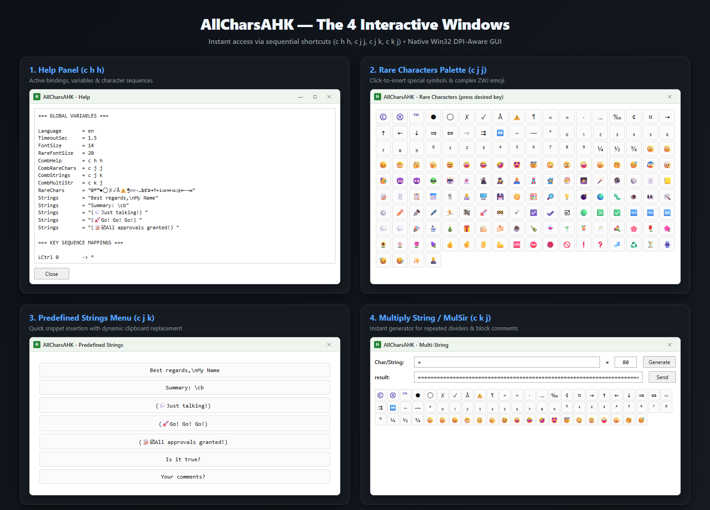

⚠️ **Note:**  
✨ **100% AI‑powered project 🪄** — concept, analysis, code, testing, documentation — with the **human** 👨‍💻 in the loop as the **big boss** 👨‍💼 for **control**, **fine‑tuning**, and **decisions** 🤔😉🤫.  

---

# AllCharsAHK ⌨️✨

> **Type diacritics, typographic symbols, and complex [Unicode](https://home.unicode.org/) characters on Windows quickly, intuitively, and without changing your keyboard layout.**

[](https://www.autohotkey.com/)
[](https://microsoft.com)
-blue.svg)
[](LICENSE)

🌐 **Language:** **English** | [Versiunea în Limba Română](doc/citeste-ma.md)

---

## 💡 What is AllCharsAHK?

**AllCharsAHK** is a script for the [AutoHotkey](https://www.autohotkey.com/) utility, natively written in **AutoHotkey v2**, inspired by the classic **Compose** key concept and the legendary *AllChars* utility. 

On any physical keyboard used (whether for programming or comfortable writing), entering special characters (such as `ă`, `ș`, `ț`, `©`, `€`, `→`, or composite emoji) typically requires switching system layouts (`Alt+Shift`) or using obscure `Alt + Numpad` codes. 

**AllCharsAHK solves this problem:** you briefly tap a trigger key (for example, `Right Ctrl` or `Right Shift`), type a short sequence of 1–2 letters, and the desired character appears instantly in your document.

> [!IMPORTANT]
> ### ⌨️ Trigger Key Convention (The Compose Key)
> In AllCharsAHK, keys are pressed **sequentially** (one after another), **not simultaneously**[^1]: briefly tap and release the trigger key, then type the characters of your desired sequence.
> 
> To define and denote trigger keys, we use the following convention:
> 
> * **Generic keys (key families — any of them):**
>   * `c` ➔ **Ctrl** (Control key)
>   * `a` ➔ **Alt** (Alt key)
>   * `s` ➔ **Shift** (Shift key)
> 
> * **Specific keys (with explicit position: `l` = Left, `r` = Right):**
>   * `lc` ➔ **Left Ctrl** &nbsp;|&nbsp; `rc` ➔ **Right Ctrl**
>   * `la` ➔ **Left Alt** &nbsp;|&nbsp; `ra` ➔ **Right Alt** (AltGr)
>   * `ls` ➔ **Left Shift** &nbsp;|&nbsp; `rs` ➔ **Right Shift**
> 
> *For example, the notation `c h h` in the manual and tables means: press and release the `Ctrl` trigger key, then type the letter `h`, followed by the letter `h`.*
> 
> 🔒 **Zero conflicts with standard Windows shortcuts (`Ctrl+A`, `Ctrl+C`, `Ctrl+V`, etc.):**  
> AllCharsAHK enters Compose mode **exclusively when you tap and briefly release** the trigger key without holding any other key simultaneously. Classic system shortcuts (where you hold `Ctrl` down while pressing a letter, e.g. `Ctrl + A` for "Select All") are not intercepted and function completely normally in any target application.

---

## 🚀 Why AllCharsAHK? (Key Advantages)

* 🪶 **Negligible memory footprint:** under **10 MB RAM** at runtime (compared to 80–150 MB for .NET or Electron-based solutions).
* 📦 **100% Portable[^2]:** Requires no administrator privileges, writes nothing to the Windows Registry, and installs no background services. Simply run the `.ahk` script or the compiled `.exe` binary.
* ⚡ **No perceptible latency:** Early-exit matching algorithm, clean low-level keyboard hook interception without input lag during regular typing.
* 🖥️ **DPI-Aware:** All graphical interfaces scale pixel-perfectly at 100%, 125%, 150%, or 200% on any display.
* 🧩 **Modern Unicode Support (Unicode 15.1):** Correctly handles grapheme clusters and complex Emoji ZWJ sequences (skin tones, professions, flags, directional indicators).

[^1]: AllCharsAHK does not interfere in any way with applications that require simultaneous key presses (key chords). Complex shortcuts in IDEs, graphic suites, games, or system utilities (e.g., `Ctrl+C`, `Ctrl+Shift+P`, `Alt+Tab`) continue to function completely unaltered.
[^2]: In this document, "portable" refers to installation portability (it can be placed in any folder on an SSD or run directly from a USB flash drive), not cross-platform OS portability. AutoHotkey (and consequently this script) is designed specifically for Windows.

---

## 🎛️ The 4 Interactive Windows



In addition to fast sequential typing, AllCharsAHK provides 4 convenient graphical panels:

| Module | Default Sequence | Description |
| :--- | :---: | :--- |
| **Help** | `c h h` | Displays all active shortcuts, system variables, and configured characters in alphabetical order. |
| **Rare Characters** | `c j j` | Visual palette of special characters and emoji. Allows continuous insertion without losing focus from your editor. |
| **Strings** | `c j k` | Menu with quick buttons for frequently used text snippets and dynamic clipboard insertion (`\cb`). |
| **Multiply String** | `c k j` | Instant generator for dividers, decorative lines, or repeated text sequences (e.g., `===...===` or `// ---`). |

---

## 🏁 Quick Start Guide

### 1. Running
Download the archive, extract it, and create (if needed) or edit the `AllCharsAHK.cfg` configuration file to suit your needs, then:
* **Option A (Pre-compiled Executable):** Download the ready-to-run package from GitHub **Releases** and run `AllCharsAHK.exe` (zero configuration required).  
or  
* **Option B (AHK Source Code):** Make sure you have [AutoHotkey v2](https://www.autohotkey.com/) installed and double-click `AllCharsAHK.ahk`.

### 2. Usage Examples
Assume the following key mappings are defined in `AllCharsAHK.cfg`:
```ini
rc a -> ă
rs a -> Ă
lc 0 -> °
rc e -> €
rc c -> "Clipboard text is:\n\"\cb\""
```
1. **Diacritics:**
   * Press `Right Ctrl`, then key `a` ➔ you get `ă`
   * Press `Right Shift`, then key `a` ➔ you get `Ă`
2. **Common symbols:**
   * `Right Ctrl` followed by `e` ➔ `€`
   * `Left Ctrl` followed by `0` ➔ `°` (degree sign)
3. **Text strings:**  
Assuming your clipboard already contains the text: `some sample text`
   * Press `Right Ctrl`, then key `c` ➔ you get:
```text
Clipboard text is:
"some sample text"
```
4. **Opening graphical panels:**
   * `Right Ctrl`, then type `h h` ➔ Opens the **Help** window.
   * `Right Ctrl`, then type `j j` ➔ Opens the **Rare Characters** palette.

---

## ⚙️ Simple Configuration (`AllCharsAHK.cfg`)

All bindings and settings are stored in a clean, UTF-8 encoded text file:

```ini
# Maximum sequence timeout (seconds)
TimeoutSec = 1.5

# Font size for graphical windows
FontSize = 14

# Font size for rare character buttons
RareFontSize = 20

# Mapping definitions: [trigger] [keys] -> [result]
rc a -> ă
rs a -> Ă
rc e -> €
lc , -> „
ls ' -> ”

# Less frequently used characters where dedicated mappings are not needed
RareChars = "©®™●◯✗✓Å⚠️¶«»·…‰¢¤→↑←↓⇒⇔⇨⇉↔–—∞"
RareChars = "₀₁₂₃₄₅₆₇₈₉⁰¹²³⁴⁵⁶⁷⁸⁹¼½¾"
RareChars = "🙂☹️😞🙃🤔🤫😉😀😂🤣🤩😇😏😠🤪🤥🥱😴😰🤕🥳😈👿👽🤖👻🥷🕵🦸🧞🧙🎅"

# Predefined text strings for the dedicated panel (c j k)
Strings = "Best regards,\nMy Name"
Strings = "Summary: \cb"
```

> [!NOTE]
> AllCharsAHK also supports equivalent Romanian configuration aliases (`TimpSec`, `DimFont`, `DimFontRare`, `RareUnic`, `Siruri`).

Supported trigger keys:
* Generic families: `c` (Ctrl), `a` (Alt), `s` (Shift).
* Specific keys: `lc` (Left Ctrl), `rc` (Right Ctrl), `ls` (Left Shift), `rs` (Right Shift), `la` (Left Alt), `ra` (Right Alt).

---

## 📚 Complete Documentation

For comprehensive details on internal architecture, comparative benchmarks with other solutions (WinCompose, native keyboards), Win32 API handling, and technical troubleshooting, see:
* 📖 [MANUAL_en.md](MANUAL_en.md) — Complete user manual and technical reference in English.
* 📖 [MANUAL_ro.md](MANUAL_ro.md) — Manualul complet de utilizare și referință tehnică în limba română.
* 🌐 [MANUAL.html](MANUAL.html) — Interactive bilingual web manual with live Win32 mockups and instant language switcher *(download and open locally in any browser)*.

---

## 👤 Author & Acknowledgements

* **Author:** Relu Percan
* **Inspiration:** Inspired by the classic *AllChars* utility for Windows originally created by Jeroen Laarhoven.
* **Ecosystem:** Built with [AutoHotkey v2](https://www.autohotkey.com/).

---

## 📄 License

This project is licensed under the terms of the **MIT** License. See the [LICENSE](LICENSE) file for complete details.

---

## 📝 Warranty

No warranty of any kind is provided!

