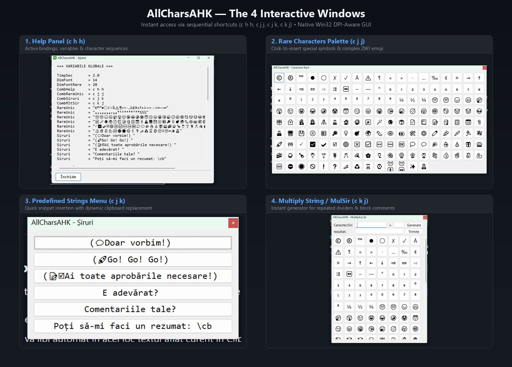

⚠️ **Notă:**  
✨ Proiect **100% AI‑powered 🪄** — concept, analiză, cod, testare, documentație — cu **omul** 👨‍💻 în buclă ca **big boss** 👨‍💼 pentru **control**, **fine‑tuning** și **decizii** 🤔😉🤫.  

---

# AllCharsAHK ⌨️✨

> **Scrie diacritice, simboluri tipografice și caractere [Unicode](https://home.unicode.org/) complexe pe Windows, rapid, intuitiv și fără a schimba layout-ul tastaturii.**

[](https://www.autohotkey.com/)
[](https://microsoft.com)
-blue.svg)
[](../LICENSE)

🌐 **Limbă:** **Română** | [English Version](../README.md)

---

## 💡 Ce este AllCharsAHK?

**AllCharsAHK** este un script pentru utilitarul [AutoHotkey](https://www.autohotkey.com/), scris nativ în **AutoHotkey v2**, inspirat de conceptul clasic de tastă **Compose** și de legendarul utilitar *AllChars*. 

Pe orice tastatură fizică utilizată (pentru programare sau confort la redactare), introducerea caracterelor speciale (precum `ă`, `ș`, `ț`, `©`, `€`, `→` sau emoji compuse) necesită de regulă schimbarea layout-ului de sistem (`Alt+Shift`) sau coduri obscure de tip `Alt + Numpad`. 

**AllCharsAHK rezolvă această problemă:** apeși scurt o tastă activatoare (de exemplu `Right Ctrl` sau `Right Shift`), tastezi o secvență scurtă de 1–2 litere, iar caracterul dorit apare instantaneu în documentul tău.

> [!IMPORTANT]
> ### ⌨️ Convenția Tastelor Activator (Tasta Compose)
> La AllCharsAHK, tastele se apasă **succesiv** (una după alta), **nu simultan**[^1]: apeși scurt și eliberezi tasta activator, apoi tastezi caracterele secvenței dorite.
> 
> Pentru definirea și notarea tastelor activator folosim următoarea convenție:
> 
> * **Taste generice (familia de taste — oricare dintre ele):**
>   * `c` ➔ **Ctrl** (tasta Control)
>   * `a` ➔ **Alt** (tasta Alt)
>   * `s` ➔ **Shift** (tasta Shift)
> 
> * **Taste specifice (cu precizarea poziției: `l` = Left / Stânga, `r` = Right / Dreapta):**
>   * `lc` ➔ **Left Ctrl** (Control stânga) &nbsp;|&nbsp; `rc` ➔ **Right Ctrl** (Control dreapta)
>   * `la` ➔ **Left Alt** (Alt stânga) &nbsp;|&nbsp; `ra` ➔ **Right Alt** (Alt dreapta / AltGr)
>   * `ls` ➔ **Left Shift** (Shift stânga) &nbsp;|&nbsp; `rs` ➔ **Right Shift** (Shift dreapta)
> 
> *De exemplu, notația `c h h` din manual și tabele înseamnă: apeși și eliberezi tasta activator `Ctrl`, apoi tastezi litera `h`, urmată de litera `h`.*
> 
> 🔒 **Zero conflicte cu scurtăturile standard Windows (`Ctrl+A`, `Ctrl+C`, `Ctrl+V` etc.):**  
> AllCharsAHK intră în modul Compose **exclusiv atunci când apeși și eliberezi scurt** tasta activator, fără nicio altă tastă apăsată concomitent. Comenzile clasice de sistem (în care ții `Ctrl` apăsat simultan cu o literă, de exemplu `Ctrl + A` pentru „Selectează tot”) nu sunt interceptate și funcționează perfect normal în orice aplicație țintă.

---

## 🚀 De ce AllCharsAHK? (Avantaje cheie)

* 🪶 **Consum infim de memorie:** sub **10 MB RAM** în execuție (față de 80–150 MB la soluțiile bazate pe .NET sau Electron).
* 📦 **100% Portabil[^2]:** Nu necesită drepturi de administrator, nu scrie în Registry-ul Windows și nu instalează servicii. Rulează direct fișierul `.ahk` sau binarul compilat `.exe`.
* ⚡ **Fără latență perceptibilă:** Algoritm cu anulare timpurie (*early exit*), interceptare curată prin hook-uri de tastatură fără întârzieri la tastarea obișnuită.
* 🖥️ **Conștient de DPI (DPI-Aware):** Toate interfețele grafice se scalează milimetric la 100%, 125%, 150% sau 200% pe orice monitor.
* 🧩 **Suport Unicode modern (Unicode 15.1):** Gestionează corect grapheme clusters și secvențe complexe Emoji ZWJ (tonuri de piele, profesii, steaguri, direcții).

[^1]: AllCharsAHK nu încurcă și nu interferează în niciun fel cu aplicațiile care necesită taste apăsate simultan (acorduri / scurtături combinate). Comenzile rapide din IDE-uri, suite grafice, jocuri sau utilitare de sistem (de exemplu `Ctrl+C`, `Ctrl+Shift+P`, `Alt+Tab`) continuă să funcționeze complet nealterate.
[^2]: În acest document „portabil” este folosit cu sensul de portabilitate la instalare (poate fi plasat într-un director aflat oriunde pe SSD sau chiar pe un stick USB), nu în sensul de portabil pe alt sistem de operare. AutoHotkey (implicit și acest script) e conceput să funcționeze numai pe Windows.

---

## 🎛️ Cele 4 Ferestre Interactive



Pe lângă tastarea directă prin secvențe rapide, AllCharsAHK pune la dispoziție 4 panouri grafice utile:

| Modul | Secvență implicită | Descriere |
| :--- | :---: | :--- |
| **Ajutor** | `c h h` | Afișează toate scurtăturile active, variabilele de sistem și caracterele configurate, ordonate alfabetic. |
| **Caractere Rare** | `c j j` | Paletă vizuală cu caractere speciale și emoji. Permite inserarea continuă fără a pierde focusul din editorul tău. |
| **Șiruri** | `c j k` | Meniu cu butoane pentru texte frecvente și inserare dinamică a clipboard-ului (`\cb`). |
| **Multiplică Șir** | `c k j` | Generator instant de separatori, linii decorative sau repetiții de text (ex: `===...===` sau `// ---`). |

---

## 🏁 Ghid Rapid de Pornire (Quick Start)

### 1. Rulare
Descarcă arhiva, dezarhivează și creează (dacă este nevoie) sau editează fișierul de configurare `AllCharsAHK.cfg` conform propriilor necesități, apoi:
* **Varianta A (Executabil gata compilat):** Descarcă pachetul direct de la secțiunea GitHub **Releases** și rulează `AllCharsAHK.exe` (fără nicio instalare prealabilă).  
sau  
* **Varianta B (Cod sursă AHK):** Asigură-te că ai instalat [AutoHotkey v2](https://www.autohotkey.com/) și rulează cu dublu-click fișierul `AllCharsAHK.ahk`.

### 2. Exemple de utilizare
Presupunem că în fișierul de configurare `AllCharsAHK.cfg` avem următoarele mapări de taste:
```ini
rc a -> ă
rs a -> Ă
lc 0 -> °
rc e -> €
rc c -> "Textul din clipboard e:\n\"\cb\""
```
1. **Diacritice:**
   * Apasă `Right Ctrl`, apoi tasta `a` ➔ obții `ă`
   * Apasă `Right Shift`, apoi tasta `a` ➔ obții `Ă`
2. **Simboluri uzuale:**
   * `Right Ctrl` urmat de `e` ➔ `€`
   * `Left Ctrl` urmat de `0` ➔ `°` (grad)
3. **Șir de caractere:**  
Presupunem că în clipboard ai deja textul: `un text oarecare`
   * Apasă `Right Ctrl`, apoi tasta `c` ➔ obții
```text
Textul din clipboard e:
"un text oarecare"
```
4. **Deschiderea panourilor:**
   * `Right Ctrl`, apoi tastezi `h h` ➔ Deschide fereastra de **Ajutor**.
   * `Right Ctrl`, apoi tastezi `j j` ➔ Deschide paleta de **Caractere Rare**.

---

## ⚙️ Configurare Simplă (`AllCharsAHK.cfg`)

Toate asocierile și setările sunt stocate într-un fișier text curat, codat UTF-8:

```ini
# Dimensiunea fontului pentru ferestrele grafice
DimFont = 14

# Dimensiunea fontului pentru butoanele de caractere rare
DimFontRare = 20

# Timp maxim de așteptare pentru finalizarea unei secvențe (secunde)
TimpSec = 1.5

# Definiții de mapări: [activator] [taste] -> [rezultat]
rc a -> ă
rs a -> Ă
rc e -> €
lc , -> „
ls ' -> ”

# Caractere mai rar utilizate în scriere pentru care nu merită să fie făcută o mapare
RareUnic = "©®™●◯✗✓Å⚠️¶«»·…‰¢¤→↑←↓⇒⇔⇨⇉↔–—∞"
RareUnic = "₀₁₂₃₄₅₆₇₈₉⁰¹²³⁴⁵⁶⁷⁸⁹¼½¾"
RareUnic = "🙂☹️😞🙃🤔🤫😉😀😂🤣🤩😇😏😠🤪🤥🥱😴😰🤕🥳😈👿👽🤖👻🥷🕵🦸🧞🧙🎅"

# Șiruri predefinite pentru panoul dedicat (c j k)
Siruri = "Salut! Cu stimă, \nNumele Meu"
Siruri = "Rezumat: \cb"
```

Activatori suportați:
* Familia generică: `c` (Ctrl), `a` (Alt), `s` (Shift).
* Taste specifice: `lc` (Left Ctrl), `rc` (Right Ctrl), `ls` (Left Shift), `rs` (Right Shift), `la` (Left Alt), `ra` (Right Alt).

---

## 📚 Documentație Completă

Pentru detalii complete despre arhitectura internă, benchmark-uri comparative cu alte soluții (WinCompose, tastaturi native), gestionarea Win32 API și rezolvarea problemelor tehnice, consultă:
* 📖 [MANUAL_ro.md](../MANUAL_ro.md) — Manualul complet de utilizare și referință tehnică în limba română.
* 📖 [MANUAL_en.md](../MANUAL_en.md) — Complete user manual and technical reference in English.
* 🌐 [MANUAL.html](../MANUAL.html) — Manual web interactiv bilingv cu exemple live și comutator instant de limbă *(se descarcă și se deschide local în orice browser)*.

---

## 👤 Autor și Mulțumiri

* **Autor:** Relu Percan
* **Inspirație:** Inspirat de utilitarul clasic *AllChars* pentru Windows, creat inițial de Jeroen Laarhoven.
* **Ecosistem:** Dezvoltat pe baza platformei [AutoHotkey v2](https://www.autohotkey.com/).

---

## 📄 Licență

Acest proiect este licențiat sub termenii licenței **MIT**. Consultă fișierul [LICENSE](../LICENSE) pentru detalii complete.

---

## 📝 Garanție

Nu se oferă absolut niciun fel de garanție!


